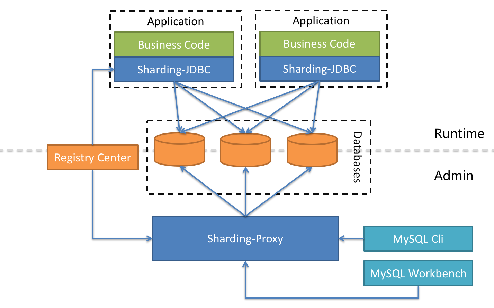

# 分库分表简介

## 业务中面临的问题

关系型数据库本身比较容易成为**系统瓶颈**，**单机存储容量、连接数、处理能力**都有限。

当单表的数据量达到**1000W或100G**以后，由于查询维度较多，即使添加从库、优化索引，做很多操作时性能仍下降严重。

 ## 解决

此时就要考虑对其进行切分了，切分的**目的就在于减少数据库的负担，缩短查询时间**。转换为分布式部署。

# 中间件分类

## 应用层依赖类中间件

***特点***

这类分库分表中间件的特点就是**和应用强耦合**，需要应用**显式依赖相应的jar包**（以Java为例），比如知名的TDDL（Taobao Distributed Data Layer 淘宝开发的分库分表框架）、当当开源的[sharding-jdbc](https://github.com/apache/incubator-shardingsphere)、蘑菇街的[TSharding](https://github.com/ctripcorp/dal)、携程开源的[Ctrip-DAL](https://github.com/ctripcorp/dal)等。

***基本思路***

**重新实现JDBC的API**，通过重新实现**DataSource、PrepareStatement**等操作数据库的接口，让**应用层在基本不改变业务代码的情况下透明地实现分库分表的能力**。

中间件给上层应用**提供熟悉的JDBC API**，**内部通过sql解析、sql重写、sql路由等一系列的准备工作获取真正可执行的sql**，**然后底层再按照传统的方法（比如数据库连接池）获取物理连接来执行sql**，最后把数据结果合并处理成ResultSet返回给应用层。

基本流程：

SQL解析----》SQL改写----》SQL路由----》SQL执行----》结果归并

***优点***

**无需额外部署**，只要**和应用绑定**一起发布即可

***缺点***

**不能跨语言**，对开发语言依赖性比较强。比如Java写的sharding-jdbc显然不能用在C#项目中，所以携程的dal也要重新写一套C#的客户端。

## 中间层代理类中间件

***特点***

这类分库分表中间件的核心原理是**在应用和数据库的连接之间搭起一个代理层**。

**上层应用**以**标准的MySQL协议**来连接代理层，然后代理层**负责转发请求**到底层的MySQL物理实例。

这种方式对应用只有一个要求，就是**只要用MySQL协议来通信即可**，所以用MySQL Workbench这种纯的客户端都可以直接连接你的分布式数据库，自然也**天然支持所有的编程语言**。比较有代表性的产品有开创性质的 [Amoeba](http://link.zhihu.com/?target=http%3A//docs.hexnova.com/amoeba/)、阿里开源的 [Cobar](https://github.com/alibaba/cobar)、社区发展比较好的[Mycat ](http://www.mycat.io/)等

***基本流程***

与应用层依赖类中间件流程基本一致

# ShardingSphere & MyCat

## 简介

ShardingSphere是一套开源的**分布式数据库中间件解决方案组成的生态圈**，它由**Sharding-JDBC、Sharding-Proxy和Sharding-Sidecar**（计划中）这3款相互独立的产品组成（**三种实现分布式数据库的方案**）。

 他们**均提供标准化的数据分片、分布式事务和数据库治理**功能，可适用于如Java同构、异构语言、容器、云原生等各种多样化的应用场景。

**ShardingSphere定位为关系型数据库中间件，旨在充分合理地在分布式的场景下利用关系型数据库的计算和存储能力，而并非实现一个全新的关系型数据库**。 它与NoSQL和NewSQL是并存而非互斥的关系。NoSQL和NewSQL作为新技术探索的前沿，放眼未来，拥抱变化，是非常值得推荐的。反之，也可以用另一种思路看待问题，放眼未来，关注不变的东西，进而抓住事物本质。

## Sharding-JDBC

### 简介

sharding-jdbc定位为**轻量级java框架**,使用客户端直连数据库,**以jar包的形式提供服务**,未使用中间层,无需额外部署,并无其他依赖,,可以理解为增强版的JDBC驱动

### 适用范围

- 适用于**任何基于Java的ORM框架**，如：JPA, Hibernate, Mybatis, Spring JDBC Template或直接使用JDBC。
- 基于**任何第三方的数据库连接池**，如：DBCP, C3P0, BoneCP, Druid, HikariCP等。
- 支持**任意实现JDBC规范的数据库**。目前支持MySQL，Oracle，SQLServer和PostgreSQL。

### 框架图

### 特点

sharding-jdbc完整的实现了**分库分表/读写分离/分布式主键功能**,并实现了**柔性事务**.

1. **分库分表**
   1. sql解析功能完善,支持聚合,分组,排序,limit等查询,并且支持级联表和笛卡尔积的表查询
   2. 支持内/外连接查询
   3. 分片策略灵活,可支持=,between,in等多维度分片,以及自定义分片策略
   4. 基于hint的强制分库分表路由
2. **读写分离**
   1. 一主多从的读写分离配置,可配合分库分表使用
   2. 基于hint的强制分库分表路由
3. **柔性事务**
   1. 最大努力送达型事务
   2. TCC型事务(TBD暂时不支持)
4. **分布式主键**
   1. 统一的分布式基于时间序列id生成器
5. **兼容性**
   1. 可适用于java的ORM框架
   2. 可基于第三方数据库连接池
6. **灵活多样配置**
   1. java
   2. springBoot
7. **分布式治理能力**

### Sharding-JDBC包

1. sharding-jdbc-config-parent  配置相关源码
2. sharding-jdbc-core   核心源码
3. sharding-jdbc-doc    文档
4. sharding-jdbc-example：针对各个模块的测试用例代码；
5. sharding-jdbc-plugin：目前只有KeyGenerator的三种实现；
6. sharding-jdbc-transaction-parent：事务相关源码；

## Sharding-Proxy

### 简介

定位为**透明化的数据库代理端**。

提供封装了数据库二进制协议的服务端版本，用于完成**对异构语言的支持**。 目前先提供MySQL/PostgreSQL版本，它**可以使用任何兼容MySQL/PostgreSQL协议的访问客户端**(如：MySQL Command Client, MySQL Workbench, Navicat等)操作数据，对DBA更加友好。

### 适用范围

- 向**应用程序完全透明**，可直接当做MySQL/PostgreSQL使用。
- 适用于**任何兼容MySQL/PostgreSQL协议的的客户端**。

### 结构图

## Sharding-Sidecar

### 简介

**定位为Kubernetes的云原生数据库代理**，以**Sidecar的形式代理所有对数据库的访问**。 通过**无中心、零侵入的方案提供与数据库交互的的啮合层**，即Database Mesh，又可称数据网格。

Database Mesh的关注重点在于如何将**分布式的数据访问应用与数据库有机串联起来**，它更加关注的是交互，是将杂乱无章的应用与数据库之间的交互有效的梳理。使用Database Mesh，**访问数据库的应用和数据库终将形成一个巨大的网格体系**，应用和数据库只需在网格体系中对号入座即可，它们都是被啮合层所治理的对象。

### 结构图

## 三者对比

| 比较项目   | Sharding-JDBC | *Sharding-Proxy* | *Sharding-Sidecar* |
| :--------- | :------------ | :--------------- | ------------------ |
| 数据库     | 任意          | MySQL            | MySQL              |
| 连接消耗数 | 高            | 低               | 高                 |
| 异构语言   | 仅Java        | 任意             | 任意               |
| 性能       | 损耗低        | 损耗略高         | 损耗低             |
| 无中心化   | 是            | 否               | 是                 |
| 静态入口   | 无            | 有               | 无                 |

## 混合架构

### 说明

Sharding-JDBC采用**无中心化**架构，适用于Java开发的**高性能的轻量级OLTP应用**；Sharding-Proxy提供**静态入口以及异构语言的支持**，适用于**OLAP应用**以及对分片数据库进行管理和运维的场景。

ShardingSphere是多接入端共同组成的生态圈。 通过混合使用**Sharding-JDBC**和**Sharding-Proxy**，并采用同一注册中心统一配置分片策略，能够灵活的搭建适用于各种场景的应用系统，架构师可以更加自由的调整适合于当前业务的最佳系统架构。

### 结构图

# Mycat

## 简介

**MyCat是一个开源的分布式数据库系统，**是一个实现了MySQL协议的服务器。

**前端用户可以把它看作是一个数据库代理**，用MySQL客户端工具和命令行访问，而其后端可以用MySQL原生协议与多个MySQL服务器通信，也可以用JDBC协议与大多数主流数据库服务器通信，**其核心功能是分表分库，即将一个大表水平分割为N个小表，存储在后端MySQL服务器里或者其他数据库里**。

## 结构图

# 二者对比

## 1.开发与运维成本

### sharding-jdbc

- sharding-jdbc是一个**轻量级框架**，不是独立运行中间件，以工程的依赖jar的形式提供功能，**无需额外部署**，可以理解为增强版JDBC驱动。
- 对运维、DBA人员**无需感知代码与分片策略规则**，运维只需要维护执行建立表和数据的迁移。
- 相对Mycat这是sharding-jdbc的优势，减少了**部署成本以及DBA学习成本**。
- 原理是通过规则改写原sql，如select * from A 根据规则变成select * from A_01，运行执行sql时就会向mysql服务器传select * from A_01指令。

### MyCat

1. 而MyCat并不是业务系统代码里面的配置，而是**独立运行的中间件**，所以配置都会交给DBA执行。
2. 对于DBA来说，他是一个在mysql Server前，增加一层代理，mycat本身不存数据，数据是在后端的MySQL上存储的，因此数据可靠性以及事务等都是MySQL保证的。
3. 为了减少迁移数据的风险，在 **推荐的增量迁移算法方案**讲述如何分片达到降低风险。 若用MyCat，**DBA需要配置多次的增量分片规则**，每配置一次则要重启一次，才能达到一轮的数据迁移。实际上**MyCat down掉的时系统都不能对数据库查询**，实际依然对所有用户有影响。
4. 然而sharding-jdbc都在**代码实现路由规则**，则可以减少DBA操作次数和系统重启次数，进而减少影响用户数。

> 推荐阅读第一章的第五节才比较好理解上述3~4点  [分库分表算法方案与技术选型（一）](https://juejin.im/post/5d6b8dbef265da03f47c38df)

1. proxy整合大数据思路，将 **OLTP 和 OLAP 分离处理**，可能会对大数据处理的系统比较适合，毕竟数据工作不一定有java后端系统。

> **该点总结：sharding-jdbc增量分片和增量迁移数据效果更佳，mycat比较适合大数据工作(支持跨语言)**

## 2.分库分表能力

- sharding-jdbc另一个优势是他的分表能力，可以不需要分库的情况下**单库分表**。
- MyCAT**不能单库分多表，必须分库**，这样就会造成让DBA增加机器节点，即使不增加机器节点，也会在同一个机器上增加mysql server实例，若使用sharding-jdbc单库分多表，则DBA只需要执行建立表语句即可。

## 3.事务

首先说说XA， XA 多阶段提交的方式，虽然对分布式数据的完整性有比较好的保障，但会极大的降影响应用性能。

- sharding-jdbc和mycat**支持弱XA**，弱 XA 就是分库之后的数据库各自负责自己事务的提交和回滚，没有统一的调度器集中处理。这样做的好处是**天然就支持**，对性能也没有影响。但一旦出问题，比如两个库的数据都需要提交，一个提交成功，另一个提交时断网导致失败，则会发生数据不一致的问题，而且**这种数据不一致是永久存在的**。
- **柔性事务是对弱 XA 的有效补充**。柔性事务类型很多。 **Sharding-JDBC** 主要实现的是**最大努力送达型**，即**认为事务经过反复尝试一定能够成功**。如果事务执行失败，则**记录至事务库**，并通过**异步**的手段**不断的尝试**，**直至事务成功**（可以设置尝试次数，如果尝试太多仍然失败则入库并需要人工干预）。在尝试的途中，数据会有一定时间的不一致，但最终是一致的。通过这种手段可以在性能不受影响的情况下牺牲强一致性，达到数据的最终一致性。
- 最大努力送达型事务的**缺点**是假定事务一定是成功的，无法回滚，因此**不够灵活**。

> **备注:** 还有一种柔性事务类型是 TCC，即 Try Confirm Cancel。可以通过事务管理器控制事务的提交或回滚，更加接近原生事务，但仍然是最终一致性。其缺点是需要业务代码自行实现 Try Confirm Cancel 的接口，对现有业务带来一定冲击。Sharding-JDBC 未对 TCC 的支持。

## 4.监控

为什么要监控，因为上述事务的弱XA、最大努力送达型，其实还是有概率失败。

- MyCat就要监控页面，监控MyCat与Mysql server的心跳，运维人员可以看到
- 而sharding-jdbc没有**监控事务是不是最终执行**了，可能需要改写源码，如果有**分片没执行成功就发一下短信**、钉钉之类的。 [MyCat监控配置样例](https://blog.csdn.net/zh15732621679/article/details/78837760)

## 5.语句限制

- sharding-jdbc分库分表使用 like 查询是有限制的。目前 Shariding-JDBC 不支持 like 语句中包含分片键，但不包含分片键的 like 语句可以正确执行。 至于 like 性能问题，是与数据库相关的，Shariding-JDBC 仅仅是解析 SQL 以及路由至正确的数据源而已。 是否会查询所有的库和表是根据分片键决定的，如果 SQL 中不包括分片键，就会查询所有库和表，这个和是否有 like 没有关系。
- MyCat没有限制

### SQL解析

从设计理念上看，两者有一定的相似性。主要流程都是

**SQL解析----> SQL改写---> SQL路由---> SQL执行---> 结果归并**

但是在**架构设计上是不同的**，如上文所述。**MyCat基于Proxy**，复写了MySQL协议，将MyCat Server伪装为一个MySQL数据库，以供上层应用调用，并且和底层数据库通信。

Sharding-JDBC**基于JDBC接口的扩展**，以jar包的形式提供**轻量级服务**。

SQL解析上，以前的Sharding-JDBC和MyCat都是使用阿里的Druid作为SQL解析的基础类库，大致的流程是 **Lexer (词法分析器)-> Parser -> AST -> Visitor** 。

sharding-JDBC现在的版本将会使用自研的SQL解析服务，对于Sharding不相关的关键词将会跳过，整体流程简化为Lexer (词法分析器)-> Parser -> ShardingContext

Sharding-JDBC 也实现了自己的事务管理引擎，ShardingTransactionManagerEngine

# 参考链接

[海量数据分库分表方案（二）技术选型与sharding-jdbc实现](https://juejin.im/post/5d739ba7e51d4561c541a729)

[sharding-jdbc与mycat(一)](https://my.oschina.net/Pirvate/blog/3017068)

[sharding-jdbc与mycat(二)](https://my.oschina.net/Pirvate/blog/3017111)

[ShardingSphere官网](https://shardingsphere.apache.org/document/legacy/4.x/document/cn/overview/)