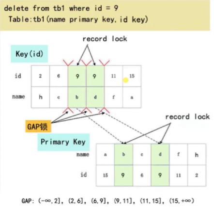
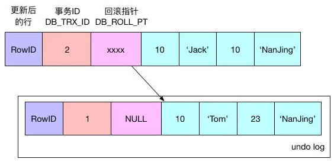

## 当前读:

**select...lock in share mode (共享读锁)
　　select...for update
　　update , delete , insert**

**当前读, 读取的是最新版本**, 并且**对读取的记录加锁, 阻塞其他事务同时改动相同**记录，避免出现安全问题。

例如，假设要update一条记录，但是另一个事务已经delete这条数据并且commit了，如果不加锁就会产生冲突。所以update的时候肯定要是当前读，得到最新的信息并且锁定相应的记录。

 

## 当前读的实现方式

**next-key锁(行记录锁+Gap间隙锁)**

**间隙锁：**只有在Read Repeatable、Serializable隔离级别才有，就是锁定范围空间的数据，假设id有3,4,5，锁定id>3的数据，是指的4，5及**后面的数字都会被锁定，**因为此时如果不锁定没有的数据，例如当加入了新的数据id=6，就会出现幻读，间隙锁避免了幻读。

1.对主键或唯一索引，如果当前读时，where条件全部精确命中(=或者in)，这种场景本身就不会出现幻读，所以只会加行记录锁。

2.没有索引的列，当前读操作时，会加全表gap锁，生产环境要注意。

3.非唯一索引列，如果where条件部分命中(>、<、like等)或者全未命中，则会加附近Gap间隙锁。例如，某表数据如下，非唯一索引2,6,9,9,11,15。如下语句要操作非唯一索引列9的数据，gap锁将会锁定的列是(6,11]，该区间内无法插入数据。

 

　　 

 

##  快照读

单纯的select操作，**不包括**上述 select ... lock in share mode, select ... for update。　　　　

Read Committed隔离级别：每次select都生成一个快照读。

Read Repeatable隔离级别：**开启事务后第一个select语句才是快照读的地方，而不是一开启事务就快照读。**

 

## 快照读的实现方式

**undolog和多版本并发控制MVCC**

下图右侧绿色的是数据：一行数据记录，主键ID是10，name='Jack'，age=10, 被update更新set为name= 'Tom'，age=23。

事务会先使用“排他锁”锁定改行，将该行当前的值复制到undo log中，然后再真正地修改当前行的值，最后填写事务的**DB_TRX_ID**，使用回滚指针**DB_ROLL_PTR**指向undo log中修改前的行**DB_ROW_ID**。

**DB_TRX_ID**: 6字节`DB_TRX_ID`字段，表示最后更新的事务id(update,delete,insert)。此外，删除在内部被视为更新，其中行中的特殊位被设置为将其标记为已软删除。

**DB_ROLL_PTR**: 7字节回滚指针，指向前一个版本的undolog记录，组成undo链表。如果更新了行，则撤消日志记录包含在更新行之前重建行内容所需的信息。
**DB_ROW_ID**: 6字节的DB_ROW_ID字段，包含一个随着新行插入而单调递增的行ID, 当由innodb自动产生聚集索引时，聚集索引会包括这个行ID的值，否则这个行ID不会出现在任何索引中。如果表中没有主键或合适的唯一索引, 也就是无法生成聚簇索引的时候, InnoDB会帮我们自动生成聚集索引, 聚簇索引会使用DB_ROW_ID的值来作为主键; 如果表中有主键或者合适的唯一索引, 那么聚簇索引中也就不会包含 DB_ROW_ID了 。 

其它：insert undo log只在事务回滚时需要, 事务提交就可以删掉了。update undo log包括update 和 delete , 回滚和快照读 都需要。