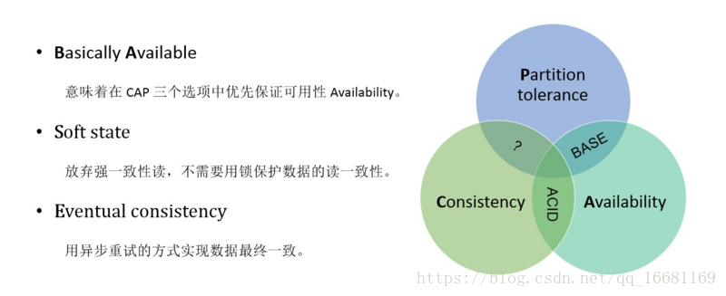

# 分布式事务之柔性事务

## 定义

在电商领域等互联网场景下，传统的事务在数据库性能和处理能力上都暴露出了瓶颈。在分布式领域基于CAP理论以及BASE理论，有人就提出了柔性事务的概念。CAP（一致性、可用性、分区容忍性）理论大家都理解很多次了，这里不再叙述。说一下BASE理论，它是在CAP理论的基础之上的延伸。包括基本可用（Basically Available）、柔性状态（Soft State）、最终一致性（Eventual Consistency）。 

### 基本可用

分布式系统出现故障的时候，允许损失一部分可用性。比如，阿里双十一大促的时候，对一些非核心链路的功能进行降级处理。 

### 柔性状态

允许系统存在中间状态，这个中间状态又不会影响系统整体可用性。比如，数据库读写分离，写库同步到读库（主库同步到从库）会有一个延时，这样实际是一种柔性状态。 

### 最终一致性

上面数据库主从复制的例子，**经过数据同步延时之后，最终数据能达到一致**。 
老的方式实现分布式事务是通过两阶段提交来实现的(2pc)。分为准备阶段和提交阶段。两阶段事务的关键是在准备阶段，在这个阶段所有参与者必须完成约束检查，达成关于分布式事务一致性的共识。第二阶段，根据之前达成的共识，完成相应的操作。提交事务的过程中需要在很多个资源节点之间进行协调，而且每个节点对锁资源的释放必须等到事务最终提交的时候。这样两阶段事务提交会耗费更长的时间。事务执行时间长意味着锁资源发生冲突的概率增加，当事务的并发量积累到一定数量的时候，很可能出现事务积压甚至出现死锁。系统的性能和吞吐量就会下降。 

而**柔性事务(遵循BASE理论)**放弃了隔离性，减小了事务中锁的粒度，使得应用能够更好的利用数据库的并发性能，实现吞吐量的线性扩展。异步执行方式可以更好的适应分布式环境，在网络抖动、节点故障的情况下能够尽量保障服务的可用性 (Availability)。因此在高可用、高性能的应用场景，柔性事务是最佳的选择。 

### 柔性事务对ACID的支持： 

1. 原子性：**严格遵循** 
2. 一致性：**事务完成后的一致性严格遵循**，事务中的一致性可适当放宽 
3. 隔离性：**并行事务间不可影响**；事务中间结果可见性允许安全放宽 
4. 持久性：**严格遵循**

## 实现方式

在业内，关于柔性事务，最主要的有以下四种类型：两阶段型、补偿型、异步确保型、最大努力通知型几种： 

### 1、两阶段型 

就是分布式事务两阶段提交，对应技术上的XA、JTA/JTS。这是分布式环境下事务处理的典型模式。

### 2、补偿型 

TCC型事务（Try/Confirm/Cancel）可以归为补偿型；

TCC思路是:**尽早释放锁**；在Try成功的情况下，如果事务要回滚，Cancel将作为一个补偿机制，回滚Try操作； 
TCC各操作事务本地化，且尽早提交 (放弃两阶段约束)；当全局事务要求回滚时，通过另一个本地事务实现“补偿”行为； 
TCC是将资源层的两阶段提交协议转换到业务层，成为业务模型中的一部分；

### 3、异步确保型 

将一些同步阻塞的事务操作变为异步的操作，避免对数据库事务的争用，典型例子是热点账户异步记账、批量记账的处理。

### 4、最大努力型 

交易的消息通知与失败重试（例如商户交易结果通知重试、补单重试）

这四种类型的柔性事务基本都有对应的实现，不同的场景需要使用不同的柔性事务类型。而这几种柔性事务类型，其实还是依赖一些基础模式的，或者叫做基础接口，基础功能。

比如，要想使用可靠消息最终一致来实现异步确保型柔性事务，就依赖幂等操作和可查询操作。 
关于具体实现，我们在后面的文章中介绍，本文简单介绍下这些实现柔性事务依赖的基础模式。注意，下面要介绍的柔性事务的模式，并不是柔性事务的方案。这些是做柔性事务的基础。也就是说，如果你想做柔性事务，你的接口和功能要满足下面的几个要求。不一定要都满足，因为不同的方案的要求不一样。但是都不满足的话，是不可能做柔性事务的。

## 模式分类

### 异步确保 

2PC的处理过程中一个很大的问题是，存在大量的同步等待，这便意味着操作之间的强耦合，一旦发生了失败或是超时，造成的影响往往是灾难性的。但是分布式情况下，超时和失败又是很可能出现的情况，所以2PC手段没法保证系统的可用性。 

那么怎么优化呢？可以将操作解耦，使用消息队列（或者某种可靠的通信机制）来连接不同的实例上的操作。这样的通信机制使操作异步化，于是我们还需要一个能够确保消息执行成功的确保机制，以上两点的综合就是现在最常用的柔性事务解决方案，我们暂且叫它“异步确保”（因为这种方案并非有一个统一的叫法），核心思路其实就是：用消息队列保证最终一致性。

### 重试与幂等 

在接下来讲到的各种思路中，我们都无法避免一个问题，那就是接口调用或者说操作的失败，分布式情况下系统的状态往往不如单机条件下确定，所以可能经常需要重试，而不是一失败就回滚。 
幂等性，其实是一个数学概念。幂等函数，或幂等方法，是指可以使用相同参数重复执行，并能获得相同结果的函数，如：f(f(x)) = f(x) 

在编程中一个幂等操作的特点是其任意多次执行所产生的影响均与一次执行的影响相同。也就是说，同一个方法，使用同样的参数，调用多次产生的业务结果与调用一次产生的业务结果相同。这一个要求其实也比较好理解，因为要保证数据的最终一致性，很多解决防范都会有很多重试的操作，如果一个方法不保证幂等，那么将无法被重试。幂等操作的实现方式有多种，如在系统中缓存所有的请求与处理结果、检测到重复操作后，直接返回上一次的处理结果等。

### 可补偿操作 

提到事务，为了保证原子性，就可能发生commit和rollback，那么在分布式事务中，要想进行rollback，就需要提供可补偿操作。比如上面的订单处理的例子中，在调用积分服务给积分帐户增加积分操作执行之后，经过分布式事务协调，最终决定回滚整个事务，那么就需要提供一个调用积分服务给积分帐户扣减积分的操作。并且，补偿操作同时也需要满足幂等性。 

记录日志+补偿。记录事务的开始和结束状态。事务根据日志记录找回事务的当前执行状态，并根据状态决定重试异常步骤，也就是正向补偿，或者回滚上一次执行步骤，也就是反向补偿。

### TCC操作 

TCC 即 Try-Confirm-Cancel，分为以下3个步骤: 

- Try：资源预留&锁定。事务发起方将调用服务提供方的Try方法来锁定业务所需要的所有资源。 
- Confirm：确认执行业务逻辑操作。这里使用的资源一定都是在Try中预留的资源，Try + Confirm 组合起来是一次完整的业务逻辑。 
- Cancel：取消执行业务逻辑。这里和普通的补偿性事务不同，因为Try阶段只是预留资源，并未真正执行操作，因此取消操作只需要释放Try阶段预留的资源，而不需要执行数据库操作来补偿。

用户通编码实现TCC并发布成服务，这个TCC服务就可以作为资源参与到分布式事务中；事务管理器分2阶段协调所有的TCC资源，使得所有TCC资源状态最终都是一致，要么全部提交，要么全部回滚；TCC自编码的特性决定TCC资源管理器可以跨DB、跨应用实现资源管理，将对不同的DB访问、不同的业务操作通过编码方式转换一个原子操作，解决了复杂业务场景下的事务问题；同时TCC的每一个操作对于DB来讲都是一个本地DB事务，操作结束则本地DB事务结束，数据库的资源也就被释放；这就规避了数据库层面的2PC对资源占用导致的性能低下问题。

## TCC与2PC协议比较 

TCC位于业务服务层而非资源层 

TCC没有单独的准备(Prepare)阶段,Try操作兼备资源操作与准备能力 Try操作可以灵活选择业务资源的锁定粒度(以业务定粒度) 

TCC有较高开发成本