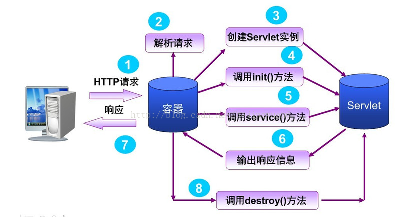

## Servlet简介

### 背景

As soon as the web began to be used for delivering services, service providers recognized the need for dynamic content. **Applets**, one of the earliest attempts toward this goal, focused on using the **client platform** to deliver dynamic user experiences. 

At the same time, developers also investigated using the **server platform** for this purpose. Initially, **Common Gateway Interface (CGI)** scripts were the main technology used to generate dynamic content. Although widely used, CGI scripting technology has a number of shortcomings, including **platform dependence** and **lack of scalability**. To address these limitations, **Java Servlet （Server Applets）**technology was created as a portable way to provide **dynamic, user-oriented content**.

对于**静态网页**而言，服务器上存在的是一个个纯HTML文件。当客户端浏览器发出HTTP请求时，服务器可以根据请求的URL找到对应的HTML文件，并将HTML代码返回给客户端浏览器。

   但是对于**动态网页**，服务器上除了找到需要显示的HTML标记外，还必须执行所需要的**业务逻辑**，然后将业务逻辑运算后的结果和需要显示的HTML标记一起生成新的HTML代码。最后将新的带有业务逻辑运算结果的HTML代码返回给客户端。


### 简介

**Servlet（Server Applet） 是在服务端运行的 Applet**。Servlet 的主要功能在于**交互式地浏览和修改数据，生成动态Web内容，用于开发 web 服务程序**。

Java Servlet 通常情况下与使用 **CGI**（Common Gateway Interface，公共网关接口）实现的程序可以达到异曲同工的效果。但是相比于 CGI，Servlet 有以下几点**优势**：

- **更优秀的性能**。Servlet 在 Web 服务器的地址空间内执行。为每个请求**创建一个线程而不是进程**处理。
- **平台无关**，因为它们是用 Java 编写的。
- **安全**。服务器上的 Java 安全管理器执行了一系列限制，以保护服务器计算机上的资源。因此，Servlet 是可信的。
- Java 类库的全部功能对 Servlet 来说都是可用的。它可以通过 sockets 和 RMI 机制与 applets、数据库或其他软件进行交互。


### Servlet 生命周期

Servlet 生命周期可被定义为**从创建直到回收**的整个过程。以下是 Servlet 遵循的过程：

- Servlet 初始化后调用 **init ()** 方法。
- Servlet 调用 **service()** 方法来处理客户端的请求。
- Servlet 销毁前调用 **destroy()** 方法。
- 最后，Servlet 是由 JVM 的垃圾回收器进行**垃圾回收**。


Servlet 整个生命周期过程如下：




1） **加载和实例化**：在第一次请求Servlet时，Servlet容器将会创建Servlet实例；

2） **init()** ：Servlet容器加载完成Servlet之后，必须进行初始化，此时，init方法将被调用，**只调用一次**；

3）**service()**： **Servlet**初始化之后，就处于响应请求的就绪状态，此时如有客户端请求发送，就会调用 Servlet 实例的service**()**方法，并且**根据用户的请求方式，调用doPost或者doGet方法**；

4） **destroy()**： 最后，**Servlet容器负责将Servlet实例进行销毁**，调用destroy方法实现；

 一般 **Servlet 只初始化一次(只有一个对象)**，当Server不再需要Servlet时(一般当Server关闭时)，Server调用Servlet的Destroy()方法。


### 多请求

 Servlet **采用多线程来处理多个请求的同时访问**。Servlet容器通过**线程池**来管理维护服务请求。所谓线程池，相当于数据库连接池，实际上是等待执行代码的一组线程，叫做工作者线程。

Servlet容器通过**一个调度线程来管理工作者线程**。

- 当容器收到一个 Servlet 的访问请求，调度者线程就从线程池中选出一个工作者线程，将用户请求传递给该线程，然后由该线程处理Servlet的service()方法；
- 当这个线程在执行的时候，容器收到一个新的请求，调度者线程再次从线程池中选出一个新的工作者线程；
- 当容器同时收到对同一个Servlet的多个请求时，那么Servlet的service方法将在多线程中并发执行。

#### 注意

- Servlet 容器**默认采用单实例多线程**的方式来处理请求。这样减少了产生Servlet实例的开销，提升了对请求的响应时间；

- 对于Tomcat容器来讲，可以在其 server.xml 中通过<Connector>中设置线程池中的线程数目。

### 示例

手动编写 Servlet

#### xml配置文件方式

（1）修改web.xml

```xml
<?xml version="1.0" encoding="UTF-8"?>
<web-app xmlns:xsi="http://www.w3.org/2001/XMLSchema-instance" xmlns="http://xmlns.jcp.org/xml/ns/javaee" xsi:schemaLocation="http://xmlns.jcp.org/xml/ns/javaee http://xmlns.jcp.org/xml/ns/javaee/web-app_3_1.xsd" id="WebApp_ID" version="3.1">
  <display-name>ServerletDemo_xml</display-name>
  <servlet>
    <!--servlet 名称，一般取servlet实现类类名-->
    <servlet-name>Myservlet</servlet-name>
      <!--servlet实现类全限定名-->
    <servlet-class>com.serverlet.test.Myservlet</servlet-class>
  </servlet>
  <servlet-mapping>
    <!--servlet 名称-->
    <servlet-name>Myservlet</servlet-name>
    <!--请求路径，映射到指定的Servlet(这里是 Myservlet)-->
    <url-pattern>/ServletDemo</url-pattern>
  </servlet-mapping>
</web-app>
```

 保存即可。

（2）处理servlet请求

```java
package com.serverlet.test;
import java.io.IOException;
import javax.servlet.ServletException;
import javax.servlet.annotation.WebServlet;
import javax.servlet.http.HttpServlet;
import javax.servlet.http.HttpServletRequest;
import javax.servlet.http.HttpServletResponse;

public class Myservlet extends HttpServlet {
    public void doGet(HttpServletRequest request, HttpServletResponse response) throws ServletException, IOException {
        response.getWriter().write("Hello Servlet3.0");
    }

    public void doPost(HttpServletRequest request, HttpServletResponse response) throws ServletException, IOException {
        this.doGet(request, response);
    }
}
```

（3）在tomcat上直接运行，访问链接

#### 注解

或者使用注解方式定义 Servlet（省去xml 配置），在Myservlet上加上注解：

```java
/**
 * 注解WebServlet用来描述一个Servlet
 * 属性name描述Servlet的名字,可选
 * 属性urlPatterns定义访问的URL,或者使用属性value定义访问的URL.(定义访问的URL是必选属性)
 */
@WebServlet(name="ServletDemo",urlPatterns="/ServletDemo")
public class Myservlet extends HttpServlet {
......
}
```


## 背景知识

### Applet

#### 简介

 Applet是一种 **java 程序，工作在客户端**。Applet必须运行于某个特定的 “**容器**”，这个容器可以是浏览器本身，也可以是通过各种插件，或者包括支持Applet的移动设备在内的其他各种程序来运行。与一般的Java应用程序不同，Applet不是通过main方法来运行的。

Applet 程序的实现主要依靠 java.applet 包中的 Applet 类，且必须**嵌入在HTML页面**中才能得到解释执行；同时Applet可以从web页面中获得参数，并**和web页面交互**。

#### 特点

Applet通过使用该Applet的HTML文件，由支持 Java 的网页浏览器下载运行，也可以通过Java开发工具的 appletviewer 来运行。**Applet程序离不开使用它的HTML文件**，这个HTML文件中关于Applet的信息至少应包含以下三点：

   （1）字节码文件名（编译后的Java文件，以.class为后缀）

   （2）字节码文件的地址

   （3）在网页上显示Applet的方式

以下是一个调用"Hello World"applet的例子:

```html
<html>
<title>The Hello, World Applet</title>
<hr>
<applet code="HelloWorldApplet.class" width="320" height="120">
If your browser was Java-enabled, a "Hello, World"
message would appear here.
</applet>
<hr>
</html>
```


#### 生命周期

Applet类中的四种基本方法用来控制其运行状态：init()、start()、stop()、destroy()

​     1、**init()**：该方法主要是为Applet的正常运行做一些**初始化**工作。当一个Applet被系统调用时，系统首先调用的就是该方法。**只调用一次**。通常可以在该方法中完成从网页向Applet传递参数，添加用户界面的基本组件等操作。

​     2、**start()**：系统在调用完 init() 方法之后，将自动调用start()方法。而且，每当用户**离开包含该Applet的主页后又再返回时，系统又会再执行一遍start()方法**。这就意味着**start()方法可以被多次执行**，而不像init()方法。因此，可以在start()方法中开始一个线程，如继续一个动画、声音等。

​     3、**stop()**：这个方法在用户**离开Applet所在页面时执行**，**也可以被多次执行的**。它使你可以在用户并不注意Applet的时候，**停止一些耗用系统资源的工作**以免影响系统的运行速度，且并不需要人为地去调用该方法。如果Applet中不包含动画、声音等程序，通常也不必实现该方法。

​     4、destroy()：与对象的 finalize() 方法不同，**Java在浏览器关闭的时候才调用该方法**。Applet是嵌在HTML文件中的，所以destroty()方法不关心何时Applet被关闭，它在浏览器关闭的时候自动执行。在destroy()方法中一般可以要求收回占用的非内存独立资源。(如果在Applet仍在运行时浏览器被关闭，系统将先执行stop()方法，再执行destroy()方法。


### Common Gateway Interface

#### 静态文件服务

在互联网的早期一个时期，那时候的 WWW 网页服务还只是简单的**静态页面**服务。它的工作过程是这样的：

- 浏览器向服务器发起文件请求，比如：`GET /a.txt`
- 服务器找到`a.txt`文件
- 服务器读取文件内容
- 服务器返回内容给浏览器
- 浏览器展示返回的内容

就像下面这张图描绘的那样：


#### 动态内容服务

不过，人们很快就觉得，直接返回文件内容的方式太单调了，因为内容完全是固定不变的，不能**动态**地生成内容，看到不同的页面。 所以，如果想要每次的请求内容都不一样（比如：显示当前时间，显示登陆者的用户名），怎么办？ 很简单，人们马上就想到了新的办法。

当服务器接收到浏览器的请求时，**把请求的路径当成一个可执行文件**，执行它，并**把可执行文件的标准输出返回给浏览器**。

它的工作过程是这样的：

- 浏览器向服务器发起一个请求，比如：`GET /cgi-bin/echo`
- 服务器找到`/cgi-bin/echo`这个可执行文件
- 服务器把请求路径，HTTP头部等值作为**环境变量**传递给可执行文件
- 服务器把HTTP请求BODY作为**标准输出**传递给可执行文件
- 服务器执行可执行文件
- 可执行文件执行内部逻辑并把输出写入**标准输出**，然后退出
- 服务器读取可执行文件的**标准输出**
- 服务器把标准输出返回给浏览器
- 浏览器展示返回的内容

就像下面这张图描绘的那样：


由于可执行文件拥有自己的逻辑，所以它可以输出任意的内容。而不像静态文件那样，内容永远是固定不变的。这样一样，浏览器就可以看到**动态**的内容了。

我们通常把由静态文件生成的网页叫作**静态网站**，而把后端可执行文件动态生成的网页叫作**动态网站**。

后端的这个可执行文件通常叫作网关程序。而服务器与网关程序之间的这个通信协议，叫作**公共网关接口（Common Gateway Interface, CGI）**。


#### 缺点

对于现在的后端开发来说，纯使用CGI作为后端已经极其少见了。因为它有很多**致命的不足**：

- 对于**每一个请求都要新启动一个进程**来处理请求

  新启动一个进程对操作系统来说开销特别大，必然造成性能不好。对于服务器的性能，一个简单的比较：同步 < 多进程 < 多线程 < 异步。

- **进程处理完请求就立即退出**

  **立即退出意味着请求与请求之间很难产生联系**，连简单的数据共享都做不到。所以后来出现了FastCGI，进程不用退出了。

- 传统的CGI程序，不具备平台无关性特征，系统环境发生变化，CGI程序就要瘫痪。

所以，后来的服务器就不怎么再支持CGI了。比如 nginx。

