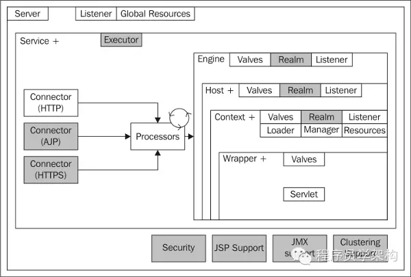
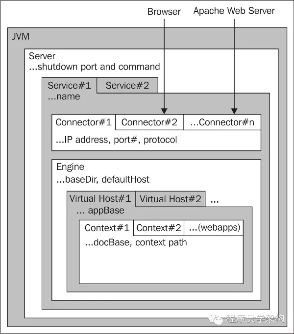
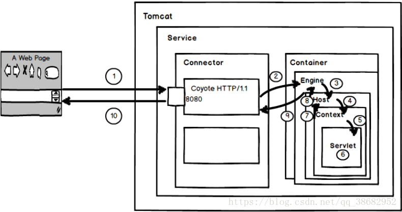

## 架构

### 简介

Tomcat 是一个免费的开放源代码的 **Web 应用服务器**，Tomcat是Apache 软件基金会（Apache Software Foundation）的 Jakarta 项目中的一个核心项目，它早期的名称为catalina，后来由Apache、Sun 和其他一些公司及个人共同开发而成，并更名为Tomcat。

Tomcat 是一个小型的轻量级应用服务器，在中小型系统和并发访问用户不是很多的场合下被普遍使用。

因为Tomcat 技术先进、性能稳定，成为目前比较流行的Web 应用服务器。Tomcat是应用（java）服务器，本质上讲，tomcat是一个jsp/servlet容器

### 整体架构

上图中：

- Service, Host, Context以及Wrapper实例之后的符号 **“+” 表示这些对象可能存在多个**。例如一个Service可能只有一个Engine，但是一个Engine可以包含一个或多个Host；
- 图中旋转的圆圈代表请求处理器的**线程池**。

### 组件结构分类

组件的总体结构如下：

####  顶级组件

**Server：表示一个Tomcat实例 (单例的)**；Server代表整个catalina servlet容器；包含一个或多个service子容器。主要是用来**管理容器下各个Serivce组件的生命周期**。

Service：代表Tomcat中一组提供服务、处理请求的组件。是一个分组结构，包括**多个Connector和一个Container**。

#### 连接器

**Connector是客户端连接到Tomcat容器的服务点**，它为引擎提供协议服务来将引擎与客户端各种协议隔离开来，如HTTP、HTTPS、AJP协议。

Connector的基本属性都是它所需要监听的 IP 地址及端口号，以及所支持的协议。还有一个关键属性就是并发处理传入请求的最大线程数。

注意，Connector的关键有：

- 连接器协议（HTTP  HTTPS  HTTP1.1  AJP  SSL proxy）
- 运行模式（BIO NIO NIO2/AIO APR）
- 多线程/线程池

#### 容器组件

**Container是容器的父接口**，用于封装和管理Servlet，以及具体处理Request请求，该容器的设计用的是典型的责任链的设计模式，它由四个自容器组件构成，分别是Engine、Host、Context、Wrapper。这四个组件是负责关系，存在包含关系。只包含一个引擎。

　**Engine 引擎：**表示可运行的 Catalina 的 servlet引擎实例，并且包含了servlet容器的核心功能。在一个服务中只能有一个引擎。同时，作为一个真正的容器，Engine元素之下可以包含一个或多个虚拟主机。**它主要功能是将传入请求委托给适当的虚拟主机处理**。如果根据名称没有找到可处理的虚拟主机，那么将根据默认的Host来判断该由哪个虚拟主机处理。

**Host 虚拟主机：作用是运行多个应用**，它负责安装和展开这些应用，并且标识这个应用以便能够区分它们。它的子容器通常是 Context。一个虚拟主机下都可以部署一个或者多个Web App，每个Web App对应于一个Context，当Host获得一个请求时，将把该请求匹配到某个Context上，然后把该请求交给该Context来处理。主机组件类似于Apache中的虚拟主机，但在Tomcat中只支持基于FQDN(完全合格的主机名)的“虚拟主机”。Host主要用来解析web.xml。

**Context上下文：代表 Servlet 的 Context**，它具备了 Servlet 运行的基本环境，它表示Web应用程序本身。Context 最重要的**功能就是管理它里面的 Servlet 实例**，一个Context对应于一个Web Application，一个Web Application由一个或者多个Servlet实例组成。

**Wrapper包装器: 代表一个 Servlet，它负责管理一个 Servlet**，包括的 Servlet 的装载、初始化、执行以及资源回收。Wrapper 是最底层的容器，它没有子容器了，所以调用它的 addChild 将会报错。 

#### 嵌套组件

 **Valve阀门：**类似于Servlet规范中定义的过滤器，用来拦截请求并在将其转至目标之前进行某种处理操作。Valve可以定义在任何容器类的组件中。Valve常被用来记录客户端请求、客户端IP地址和服务器等信息，这种处理技术通常被称作请求转储(request dumping)。请求转储valve记录请求客户端请求数据包中的HTTP首部信息和cookie信息文件中，响应转储valve则记录响应数据包首部信息和cookie信息至文件中。

**Logger日志记录器：**用于记录组件内部的状态信息，可被用于除Context之外的任何容器中。日志记录的功能可被继承，因此，一个引擎级别的Logger将会记录引擎内部所有组件相关的信息，除非某内部组件定义了自己的Logger组件。

**Loader类加载器：**负责加载、解释Java类编译后的字节码。

**Realm领域：**用于用户的认证和授权；在配置一个应用程序时，管理员可以为每个资源或资源组定义角色及权限，而这些访问控制功能的生效需要通过Realm来实现。Realm的认证可以基于文本文件、数据库表、LDAP服务等来实现。Realm的效用会遍及整个引擎或顶级容器，因此，一个容器内的所有应用程序将共享用户资源。同时，Realm可以被其所在组件的子组件继承，也可以被子组件中定义的Realm所覆盖。

**Excutor执行器：**执行器组件允许您配置一个共享的线程池，以供您的连接器使用。从tomcat 6.0.11版本开始。

**Listener监听器：**监听已注册组件的生命周期。

**Manager会话管理器：**用于实现http会话管理的功能，tomcat6种有5种会话管理的manager的实现（standardManager、persisentManager、DeltaManager、BackupManager、SimpleTcpReplicationManager）。会话让使用无状态HTTP协议的应用程序完成通信。会话表示客户端和服务器之间的通信，会话功能是由javax.servlet.http.HttpSession 的实例实现的，该实例存储在服务器上而且与一个唯一的标识符相关联，客户端在与服务器的每次交互中根据请求中的标识符找到它的会话。一个新的会话在客户端请求后被创建，会话一直有效直到一段时间后客户端连接超时，或者会话直接失效例如客户退出访问服务器。

**Cluster集群：**专用于配置Tomcat集群的元素，可用于Engine和Host容器中。

### 启动过程

- Tomcat 先根据/conf/server.xml 下的配置启动Server，再加载Service，对于与Engine相匹配的Host，每个Host 下面都有一个或多个Context。
- Web Application 对应一个Context，每个Web Application 由一个或多个Servlet 组成。当一个Web Application 被初始化的时候，它将用自己的ClassLoader 对象载入部署配置文件web.xml 中定义的每个Servlet 类。
- 每个被载入的Servlet 类都有一个名字，且被填入该 Context 的映射表(mapping table)中，和其配置的URL 路径对应。
- 当该Context 获得请求时，将查询mapping table，找到被请求的Servlet，并执行以获得请求响应。

### 处理流程

1. 用户点击网页内容，请求被发送到本机端口8080，被在那里**监听的标准连接器Coyote HTTP/1.1 Connector**获得。 
2. Connector把该请求交给它所在的 Service 的Engine来处理，并等待Engine的回应。 
3. Engine获得请求 localhost/test/index.jsp，匹配所有的虚拟主机Host。 
4. **Engine匹配到名为localhost的Host**（即使匹配不到也把请求交给该Host处理，因为该Host被定义为该**Engine的默认主机**），名为 localhost的Host获得请求 /test/index.jsp，**匹配它所拥有的所有的Context**。Host匹配到路径为 /test的Context（如果匹配不到就把该请求交给路径名为 “ ” 的Context去处理）。 
5. path=“/test”的Context获得请求/index.jsp，在它的**mapping table**中寻找出对应的Servlet。Context匹配到URL PATTERN为 *.jsp 的 Servlet 对应于JspServlet类。 
6. **构造HttpServletRequest对象和HttpServletResponse对象**，作为参数调用JspServlet的doGet（）或doPost()。执行业务逻辑、数据存储等程序。 
7. Context把执行完之后的 HttpServletResponse 对象返回给Host。 
8. Host把HttpServletResponse对象返回给Engine。 Engine把HttpServletResponse对象返回Connector。 Connector把HttpServletResponse对象返回给客户Browser。

