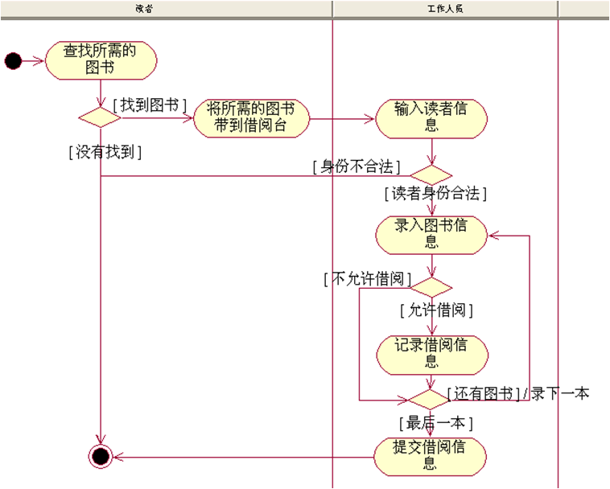

# 一、UML是什么？

## UML是什么？

**Unified Modeling Language（统一建模语言）是对象管理组织（OMG）制定的一个通用的、可视化的建模语言标准**。可以用来可视化（visualize）、描述（specify）、构造（construct）和文档化（document）软件密集型系统的各种工件（artifacts，又译制品）

UML是一种标准的图形化建模语言，是面向对象分析与设计的**标准表示**，它：

**不是一种程序设计语言**，而是一种**可视化的建模语言**(**用于分析设计**)

不是工具或知识库的规格说明，而是一种建模语言规格说明，是一种**表示的标准**

不是过程，也不是方法，但允许任何一种过程和方法**使用**它

## UML有什么用？

软件开发系统规模比较复杂时，需要用**图形抽象地表达复杂概念**，增强设计的灵活性、可读性和可理解性，以便暴露深层次的设计问题，降低开发风险。有必要采用一套通用的图形语言和符号体系描述组织的业务流程和软件需求，促进**业务人员、开发人员之间一致、高效地交流**。

# 二、UML的历史

## UML发展背景：

P. Coad和E.Yourdon提出OOA和OOD

G. Booch提出面向对象开发方法

Jacobson提出OOSE

Rumbaugh提出的OMT

……

UML的出现结束了这场方法学战争

## UML发展历程：

# 三、UML的上层结构（Superstructure）

至于UML底层的基础结构（Infrastructure），软件开发工程师们没必要了解，只需要懂得上层结构就行了。

| 构造块(building blocks)                                      | 通用机制（common mechanisms）                                | 构架（architecture）                                         |
| :----------------------------------------------------------- | ------------------------------------------------------------ | ------------------------------------------------------------ |
| 事物(things) : 结构、行为、分组、注释   关系(relationships) : 依赖、关联、泛化、实现  图(diagram) : 静态(7种)：类图、对象图、构件图、部署图、包图、组合结构图、外廓图   动态(7种)：顺序图、通信图、时间图、交互纵览图、活动图、状态机图、用例图 | **规格说明(Specifications)**：文本维度的模型描述 **修饰(Adornments)**：描述建模元素的细节信息 **通用划分(Common Divisions)**：建模时对事物的划分方法 **扩展机制(Extensibility Mechanisms)**：构造型、约束、标记值 | 4+1视图  UML中的视图包括用例视图（Use Case View）、逻辑视图（Logical View）、实现视图（Implementation View）、进程视图（Process View）、部署视图（Deployment View）等，这5个视图被称作”4+1”视图.  |

# 四、UML建模工具

比较流行的有Rational Rose ，Microsoft Visio、Enterprise Architect 、Visual UML等。

# 五、UML的图（重点）

## 用例图（use case diagram）

| 说明                                                         | 示例                                                         |
| ------------------------------------------------------------ | ------------------------------------------------------------ |
| **用例图（Use Case Diagram）**是被称为**参与者(Actor)的外部用户所能观察到的系统功能的模型图**      列出系统中的用例和参与者      显示哪个参与者参与了哪个用例的执行 **核心概念**     **用例**：系统中的一个功能单元，可以被描述为参与者与系统之间的一次交互作用     **参与者、参与者泛化**     **用例与参与者之间的关系**：关联     **用例之间关系**：扩展、包括、泛化 **推荐使用场合**     业务建模、需求获取、定义 |                                 |
| 某图书馆管理系统： 是一个基于Web的计算机应用系统； 读者可以查询图书信息以及借阅信息； 读者可以通过系统预约所需的图书； 图书馆工作人员利用该系统完成读者的借书、还书业务； 图书馆工作人员可以对图书信息、读者信息等进行维护； 对于到期的图书，系统会自动向读者发送催还信息； 管理员会定期进行系统维护； …… | UC01：“借书”用例文档 用例名称：借书 用例标识：UC01 涉及的参与者：工作人员 涉及的用例：无 描述：工作人员利用该用例为读者完成借书过程 前置条件：工作人员必须登录到当前系统 涉众利益：      读者：能够方便的找到并借出所需的图书      工作人员：能够快速并准确的完成借书工作 基本事件流：工作人员帮助读者借阅图书    1.用例起始于读者带着所要借的图书来到借阅前台；    2.工作人员录入读者信息；    3.工作人员逐一录入所有的图书信息：    * 3.1 工作人员录入一本图书信息；    * 3.2 系统确认该读者可以借阅当前图书；    4.工作人员确认本次借阅信息；    5.系统记录本次借阅情况。 后置条件：系统将读者借阅信息正确地记录到数据库中 备选事件流     2a. 读者身份不合法    2b. 读者存在欠费信息，不允许借书    3.2a. 该读者不允许借阅当前图书 字段列表：    5. 借阅信息主要包括：读者图书证号、图书编号、借阅日期（默认为当天日期）、借阅天数以及归还日期。 业务规则    3.2 系统根据当前读者的借阅规则来判断是否可以借阅图书；而借阅规则取决于读者的类型(如本科生、研究生、老师等)和图书的类型(如科技类、文学类、新书等)，并可动态配置 非功能需求：无 设计约束：无 部署约束：无 未解决的问题    2b. 读者存在多少欠费记录时，才不允许借书？    3.3 借阅规则的具体配置情况需和用户进一步讨论？ |

## 2、活动图（activity diagram）

| 说明                                                         | 示例                    |
| ------------------------------------------------------------ | ----------------------- |
| 活动图（Activity Diagram） 通过动作来组织，主要用于描述某一方法、机制或用例的内部行为 核心概念 状态、活动、组合活动、对象 转移、分支 并发、同步 泳道 推荐使用场合 业务建模、需求、类设计 |  |

 

## 3、静态结构图

| 类别                                    | 说明                                                         | 示例                      |
| --------------------------------------- | ------------------------------------------------------------ | ------------------------- |
| 类图(Class Diagram)                     | 是软件的蓝图，详细描述了系统内各个对象的相关的类，以及这些类之间的静态关系。 核心概念：**类、接口、依赖、关联、泛化、实现** 类图展示实体类的静态关系： |    |
| 对象图(Object Diagram)                  | 表示在某一时刻类的对象静态结构和行为。 核心概念：对象、链接、多重性 对象图展示我当前借书情况： |  |
| 包图(Package Diagram)                   | 展现有模型本身分解而成的组织单元(包)以及它们的依赖关系。 核心概念：包(、框架、层、子系统) 、依赖 包图展示系统分层结构： |    |
| 组合结构图(Composite Structure Diagram) | 描述系统中某一部分(组合结构)的内部结构，包括该部分与系统其它部分的交互点。  核心概念：组合结构、部件、端口、协议 组合结构图展示借书内部结构： |  |

 

## 4、顺序图（Sequence Diagram）

| 说明                                                         | 示例                      |
| ------------------------------------------------------------ | ------------------------- |
| **顺序图（Sequence Diagram）** 用于显示对象间的交互活动 关注对象之间消息传送的时间顺序 **核心概念** 对象、生命线、激活、交互、消息 交互帧(Interaction Frame) **推荐使用场合** 用例分析、用例设计 |  |

## 5、时间图(Timing Diagram)

| 说明                                                         | 示例                      |
| ------------------------------------------------------------ | ------------------------- |
| 时间图(Timing Diagram) 一种交互图，展现消息跨越不同对象或角色的实际时间信息； 具体描述单个或多个对象状态变化的时间点以及维持特定状态的时间段； 顺序图是表示交互的主要手段，可以在顺序图中增加时间约束来表明对象状态变化的时间点以及维持特定状态的时间段。 核心概念 时间约束、持续时间约束、生命线 状态、条件、事件 |  |

## 6、状态机图(State Machine Diagram)

| 说明                                                         | 示例                        |
| ------------------------------------------------------------ | --------------------------- |
| 状态机图(State Machine Diagram) UML1.x为状态图(Statechart Diagram) 利用状态和事件描述对象本身的行为 主要概念 状态、初态、终态、复合状态 事件、转移、动作 并发 推荐使用场合 类设计 |  |

## 7、部署图（Deployment Diagram）

| 说明                                                         | 示例                      |
| ------------------------------------------------------------ | ------------------------- |
| 部署图（Deployment Diagram） 描述系统所需的硬件构件的物理部署 主要概念 节点、构件、位置 连接、依赖 推荐使用场合 系统设计、实施、部署 |  |