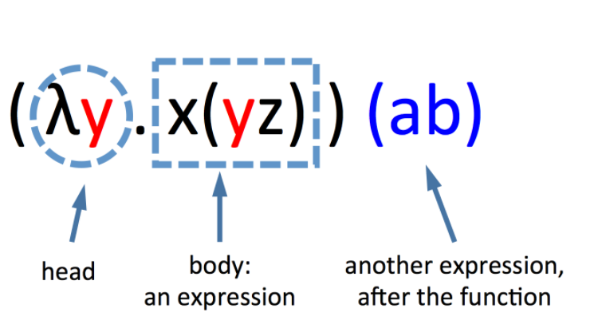
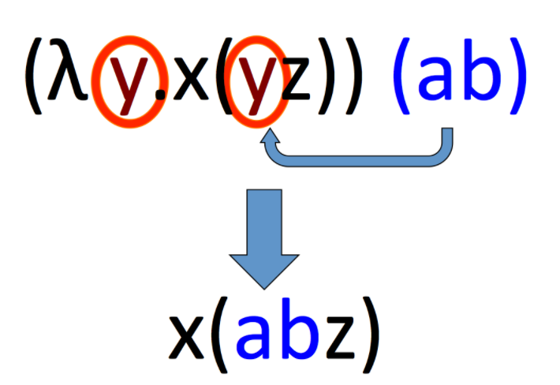
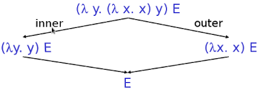

# 编程语言的基石–Lambda calculus

Lambda calculus我们一般称为[λ演算](http://en.wikipedia.org/wiki/Lambda_calculus)，最早是由[邱奇（Alonzo Church，图灵的博导）](http://en.wikipedia.org/wiki/Alonzo_Church)在20世纪30年代引入，当时的背景是解决[函数可计算的本质](http://en.wikipedia.org/wiki/Computable_function)性问题，初期λ演算成功的解决了在可计算理论中的[判定性问题](http://en.wikipedia.org/wiki/Entscheidungsproblem)，后来根据[Church–Turing thesis](http://en.wikipedia.org/wiki/Church–Turing_thesis)，证明了**λ演算与图灵机是等价**的。

下面重点介绍λ演算的具体内容，并且阐述 λ演算 是如何奠基了我们现在常用的编程语言（如：Java、python、Lisp等）的基石。


## λ演算的语法与求值

### 语法(syntax)

因为λ演算研究的是**函数的本质性**问题，所以形式极其简单，有如下形式：

```oz
E = x           variables                      //形式1 变量
  | λx. E       function creation(abstraction) //形式2 abstraction
  | E1 E2       function application           //形式3 application
```

上面的 **E 称为λ-表达式(expressions) 或 λ-terms**，三种形式如下：

1. **变量(variables)**。
2. **函数声明或抽象(function creation/abstraction)**。这是一个表达式，` λx.E`表示“一个参数参数为`x`的函数，它的**返回值为`E`的计算结果**”。可**将函数看成值，可返回赋值等（first-class function）**。需要注意是的，函数中**有且仅有**一个参数。
3. **函数应用(function application)**。把函数值放在参数前面，如`(lambda x . plus x x) y`。也就是**函数调用**，但官方术语就叫函数应用，本文后面也会采用“应用”的叫法。

**每个表达式（expressions）只包含以下符号**：

- **字母**（abcd...)，被称作变量。一个表达式可以是单个字母，或多个字母。一般的，我们可以把两个表达式写在一起组成一个新的表达式。
- **括号()**。括号表明表达式被括起来的部分是一个整体（就像句子中的括号表示这部分是一个整体）。当我们没有括号时，我们从左到右分析表达式。
- **希腊字母 λ**(发音：Lambda)**和点(.)**。 λ和点，可以描述函数。函数由λ和变量开头，跟上一个点，然后是表达式。 λ 没有任何特别的含义，只是说函数由此开始。在λ后面，在点之前的字母，我们称作的变量，点之前的部分，被称作头部(head)，点后面的表达式，被称作体(body)部。

如表达式： `(λx.xy) (ab)`，其结构如下：




### 构建规则

λ-表达式有如下的**构建规则**：

1. 所有变量（variable）都是 λ表达式（λ-terms/expression，lambda 演算中的合法表达式）;    //上面的形式1
2. 如果 x和y 是λ 表达式，那么 (xy) 也是λ表达式; 
3. 那么 (λx.y) 也是 λ表达式。

通过这三条规则，我们可以写出所有的λ表达式。如果我们从左向右读λ表达式，我们可以少写一些括号：(λy.xy) ab 是 ((λy.(x y)) a) b 的化简。

((λy.(x y)) a) b  表达式的构建过程如下：

1. x和y 是表达式，所以由规则2，有 (xy) 是表达式；
2. 所以由规则3，有 λy.(xy)  也是表达式；
3. 所以由规则2，有 (λy.(xy))a 也是表达式；
4. 所以由规则2，有 ((λy.(xy))a)b 也是表达式；
5. 构建完毕。


#### λ表达式例子


在使用λ演算时，有一些惯例需要说一下：

1. 从上面构建规则可知，函数声明时，函数体尽可能的从左向右扩展，可以简化表达式书写。

   ```
   λx.xλy.x y z ===> λx. (x(λy.((x y) z)))
   ```

2. 函数应用时，遵循左结合。例如： x y z 应该解释为 (x y) z


#### Currying（柯里化）

从上面我们知道，λ演算中函数只有一个参数，那两个参数的函数的是不是就没法表示了呢？

实际上**函数可以包含函数**，因为函数是表达式，**表达式可以包含其他表达式**，所以函数可以是其他表达式体（body）的一部分。事实上我们有这样的表达式 λx.λy.xzy，但通常我们这样缩写成 λxy.xzy。这表示我们会**先尝试在体（xzy)中替换头部的x，然后替换y，以此类推**。

 `λxy.(plus x y)----> λx.(λy.plus x y)` 上面这个转化就叫currying，它展示了我们如何实现加法（这里假设plus 这个符号已经具有相加的功能）。

其实就是我们现在意义上的**闭包**——**调用一个函数，返回另一个函数，返回的函数中存储保留了调用函数的变量**。currying 是闭包的鼻祖。

用 Python 来表示如下：

```python
def add(x):
    return lambda y: x+y

add(4)(3) //return 7   
```

如果用函数式语言clojure来表示就是：

```clojure
(defn add [x]
  (fn [y] (+ x y)))

((add 4) 3) ;return 7
```


### 求值(evaluation)

在λ演算中，有两条求值规则：

1. Alpha equivalence( or conversion )
2. Beta reduction


#### Alpha equivalence

**Alpha也被称为「转换」**

这个比较简单也好理解，就是说 λx.x 与 λy.y 是等价的，更换变量名不会改变函数的意义。

在一些变量覆盖的场合很重要，如下这个例子： `λx.x (λx. x)`如果你这么写的话，第二个函数定义中的x与第一个函数定义中的x重复了，也就是在第二个函数里把第一个的x给覆盖了。如果改为`λx.x (λy. y)`就不会有歧义了。


#### Beta reduction

**Beta也被称为「规约」**

这个规则是λ演算中函数应用的重点。一句话来解释就是，把**参数应用到函数体中**。

如果函数后边又跟了一个表达式时，那么这个函数可以被**求值（evaluation）**。

求值过程就是将**头部的相应变量去除**，然后将它所有在体部的出现的该变量**替换**成函数后面的表达式。

1. 首先**剪切函数后面的表达式，然后粘贴进体**，替换和头部同名的那个变量；
2. 然后把**头部的变量删除**，因为它已经完成了它的使命，告诉我们替换哪个变量。
3. 直到没有表达式可以继续求值，求值完成。

**求值是我们在 λ演算 过程中唯一可以做的事情**。

示例如下：



**注意：**

**如果后面有多个表达式，求值的顺序是从左到右的顺序。**

举一个例子： 有这么一个函数应用`(λx.x)(λy.y)`，在这里把`(λy.y)`带入前面函数的x中，就能得到最终的结果`(λy.y)`，这里传入一个函数，然后又返回一个函数，这就是最终的结果。


#### 求值顺序

考虑下面这个函数应用

```
(λy.(λx. x) y)E
```

有两种求值方法，如下图 



可以先计算内层的函数调用再计算外层的函数调用，反之也可。

 根据[Church–Rosser定理](http://en.wikipedia.org/wiki/Church–Rosser_theorem)，这两种方法是等价的，最终会得到相等的结果，如上图最后都得到了E。 但如果我们要自己实现一种语言，就有可能必选二选其一，于是有了下面两种方式：

1. **Call by Value ( Eager Evaluation 尽早求值 )** 。上图中的inner，这种方式**在函数应用前，先计算函数参数的值**。如：

   ```
   (λy. (λx. x) y) ((λu. u) (λv. v)) --->
   (λy. (λx. x) y) (λv. v)  --->
   (λx. x) (λv. v)  --->
   λv. v
   ```

   

1. **Call by Name (Lazy Evaluation 惰性求值)** 。上图中的outer，这种方式**在函数应用前，不计算函数参数的值，直到需要时才求值**。如：

   ```
   (λy. (λx. x) y) ((λu. u) (λv. v)) --->
   (λx. x) ((λu. u) (λv. v)) --->
   (λu. u) (λv. v) --->
   λv. v
   ```


值得一提的是，**Call by Name这种方式在我们目前的语言中，只有函数式语言支持**。


## λ演算与编程语言的关系

在λ演算中只有函数（变量依附于函数而有意义），如果要用 纯λ演算 来实现一门编程语言的话，我们还需要一些数据类型，比如 boolean、number、list 等，那怎么办呢？ 

λ的强大又再一次展现出来，**所有的数据类型都能用函数模拟**，秘诀就是 `不要去关心数据的值是什么，重点是我们能对这个值做什么操作`，然后我们用合法的 λ表达式 把这些操作表示出来即可。

我们先从最简单的——boolean开始。


### 编码Boolean

Ask：我们能对 Boolean 值做什么？ Answer：**进行条件判断，二选其一**。

知道了能对 Boolean 的操作，下面就用 λ表达式 来定义 Boolean：

```scheme
true = λx. λy. x   (1)               // true 条件的 lambda 函数
false = λx. λy. y  (2)               // false 条件的 lambda 函数
if E1 then E2 else E3 = E1 E2 E3 (3) // if 函数
```

简单解释一下：Boolean 就是这么一个函数，它有两个参数（通过currying实现），根据条件返回其中一个。

下面看个**例子**：

条件语句 if true then u else v 根据上式(3) “E1 E2 E3”可以写成如下表达式 ：

```
E1 E2 E3 ==> true u v --> (λx. λy. x) u v ---> (λy. u) v ---> u
```

例子中，根据条件 (λx. λy. x)  返回 u 和 v 其中的一个，u 是条件为真时才进行运算的表达式，v 是条件为假时要进行的运算。因为 条件为真（通过表达式求值结果也可以反推结论），返回了 u。


### 编码pair

**pair其实就是序列对**，如(1 2)、(hello world)，这些就是pair，只有两个元素，list就是通过pair连接起来形成的。

Ask：我们能对pair做什么？ Answer：**能够选择pair中的任意一个元素**

知道了能对pair的操作，下面就用 λ表达式来定义 pair：

```scheme
mkpair x y = λb.(b x y)  (1)  // mkpair 函数
fst p      = p true       (2)  // first 函数
snd p      = p false      (3)  // second 函数
```

在式（1）中 x 和 y 是 mkpair 函数的参数。根据 curring 原则，**传递多个参数实质上还是每次运算单个参数，返回了一个函数。**

这里用到了true与false的编码。解释一下： pair 就是这么一个函数，参数是一个boolean值，根据这个参数确定返回值。

还是看**例子**：

取 pair (x y)的第一个值，根据上式（2）有如下：

```
fst (mkpair x y)--->(mkpair x y) true--->λb.(b x y) true ---> true x y--->x   
```

这样我们就能取到pair的第一个元素了。


### 编码number

这里讲的number是指的**自然数**。

Ask：我们能对number做什么？ Answer：能够**依次遍历这些数字**

好，知道了能对number的操作，下面就用λ表达式来定义它（丘奇数–Church Numerals）：

```
0 = λf. λs. s
1 = λf. λs. f s
2 = λf. λs. f (f s)
......
对于任何数“n”，它的丘奇数是将其第一个参数 f 应用到第二个参数 s 上“n”次的函数
```

上面的定义其实相当于一个具有两个参数的函数：一个函数 f，另一个是起始值 s，然后不断应用 f 实现遍历数字的操作。

理解：**将 “`s`” 作为是对于 “0” 的命名，而 “`f`” 作为后继函数的名称。**

因此，0是一个仅返回 “0” 值的函数；1是将后继函数运用到 0 上一次的函数；2 则是将后继函数应用到零的后继上的函数。以此类推。


### 基本运算


#### 原始定义

如果我们想要做加法，`x + y`，我们需要写一个有四个参数的函数：两个需要相加的数字；以及推导数字时用到的“`f`”和“`s`”：

```scheme
let add = lambda f s x y . x f (y f s) 
```

将其柯里化：

- 首先，它接受两个参数，这是我们需要做加法的两个值；

- 第二，它需要正则化（normalize）这两个参数，以使它们都使用对0（`s`）和后继值（`f`）的绑定（即，将参数都写成`s`和`f`的组合的形式）。

```scheme
let add = lambda x y . (lambda f s . (x f (y f s)))
```

上式理解：

1. 为了将 `x` 和 `y` 相加，先用参数 `s` 和 `f` 创建（正则化的）丘奇数 `y`；
2. 然后应用 `x` 到上一步正则化的丘奇数 `y` 上 。（要计算`x + y`，先计算 `y` 是 `f` 的几号后继，然后计算 `x` 是 `y `的几号后继）

例 ： `2 + 3` 的运算过程

```scheme
add (lambda f s . f (f s)) (lambda f s . f (f (f s)))
```

为了更容易理解，对数字2和3做 alpha 变换，“2”用“f2”和“s2”代替，3用“f3”和“s3”代替：

```scheme
add (lambda f2 s2 . f2 (f2 s2)) (lambda f3 s3 . f3 (f3 (f3 s3))) 
```

对 `add` 的定义做替换（带入 add 定义）：

```scheme
(lambda x y .(lambda f s. (x f (y f s)))) (lambda f2 s2 . f2 (f2 s2)) (lambda f3 s3 . f3 (f3 (f3 s3))) 
```

对`add`做beta规约：

```scheme
lambda f s . (lambda f2 s2 . f2 (f2 s2)) f (lambda f3 s3 . f3 (f3 (f3 s3)) f s) 
```

然后对丘奇数”3” 做beta 规约。其实是**“正则化”**3：把数字3的定义里的后继函数和零函数替换成 `add` 的参数列表里的后继函数和零函数：

```scheme
lambda f s . (lambda f2 s2 . f2 (f2 s2)) f (f (f (f s))) 
```

然后再对丘奇数”2”做beta规约。 **丘奇数 2 是一个函数，它接受两个参数：一个后继函数 和 0(函数)**。

于是，要相加2和3，我们要把后继函数（这里是 f ）应用到 2 的第一个参数；用 丘奇数3 （这里是(f (f (f s))) ）的运算结果应用到第二个参数（0函数）！

```
lambda s z . s (s (s (s (s z)))) 
```

于是，我们的结果是：丘奇数”5”！


#### 另外一种定义方式

首先我们需要定义一个**后继函数(The successor function)**

```
succ n = λf. λs. f (n f s)
```

然后，就可以定义加法与乘法了

```scheme
add n1 n2 = λn1.λn2. n1 succ n2      (1) add 函数定义
mult n1 n2 = λn1.λn2.λf. n1 (n2 f)   (2) 或者
mult n1 n2 = λn1.λn2. n1 (add n2) 0  (3)
```


只看定义要想弄懂应该还是有些困难，下面看个具体的例子：

```
add 0 = (λn1. λn2. n1 succ n2) 0  // 由上式(1)展开 add 函数
 
-------将 0 带入 n1，并将 0 展开为表达式可得-------->
λn2. 0 succ n2 = λn2. (λf. λs. s) succ n2 
 
-------将 succ 带入 f，n2 带入 s，可得-->
λn2. n2 = λx. x
```

可能有个疑问，add不是两个参数吗，怎么就加一个0呢？其实还是 currying  没理解好，两个参数的函数内部也是用一个参数的函数来表示的。

如果只传递一个参数，那么我们就知道还会返回一个函数，本例中就是`λx. x`，这是恒等函数，也就是说加 0 ,相当于什么也没加，还是本身。

下面再来看个“难点”的例子——`1+1`：

```
add 1 1 --->
1 succ 1 ---> (λf. λs. f s) succ 1 ---> ( λs. succ s) 1 --->
succ 1 --->  λf. λs. f (1 f s) --->
λf. λs. f (f s) ---> 2
```


最后一个例子，`2*2`：

```scheme
mult 2 2 --->
λn1.λn2.2 (add 2) 0 ---> λn1.λn2.(λf. λs. f (f s)) (add 2) 0 --> λn1.λn2.(λs. (add 2) ((add 2) s)) 0
λn1.λn2.(add 2) ((add 2) 0) --->
2 succ (add 2 0) --->
2 succ (2 succ 0) --->
succ (succ (succ (succ 0))) --->
succ (succ (succ (λf. λs. f (0 f s)))) --->
succ (succ (succ (λf. λs. f s))) --->
succ (succ (λg. λy. g ((λf. λs. f s) g y)))
succ (succ (λg. λy. g (g y))) --->......---> λg. λy. g (g (g (g y))) = 4
```


原则很简单，就是**不断进行函数应用**

需要注意的就是这里的2、0不再是单纯的数字了，它是具有两个参数的函数，如果你应用时只传入一个参数，说明它还会返回一个函数。

通过这个例子能明确一点：`值是什么不重要，重要的是我们能对这个值进行的操作`。

最后一个例子：

```
如果想要判断一个数字是否为0，可以这么定义                
iszero n = n (λb. false) true    
```

。

## λ-演算与图灵机

本文一开始就说明了，λ-演算与图灵机是等价，这里简单说下我对图灵机的理解：

> 在一个不限时间、不限资源的前提下，图灵机通过前进、后退、跳转、输出1或0这四个简单的命令，在一条无限长的纸带上执行事先编好的程序。

根据目前的证明，图灵机是宇宙间最强大的机器（理想中的），我们现有的计算机都没有超过图灵机。

如果说一个语言是图灵完备的，就是说，世界上任何可计算性问题，它都能解决。

我们现有的命令式语言，如C、Java等就是以图灵机为基础的。如果说这些语言图灵完备，需要具有以下两个特征：

1. 有if、goto语句（或while、for之类的循环语句）
2. 能够进行赋值操作（也就是改变内存状态）

与图灵机对应，λ-演算的直接影响是函数式编程语言，如lisp、Haskell等，如果说这些函数式语言图灵完备，需要有以下两个特征：

1. 能够进行函数抽象（也就是函数定义）
2. 能够进行函数应用（也就是函数调用）

鉴别一个语言**是不是函数式的标准是：能否在运行时创建函数，如果能，就是函数式语言**。

## 总结

上面用一些无意义符号表达了我们已经熟知的一些概念，这就是**λ演算的精髓之处：通过一套形式化的规则来描述这些概念**。通过形式化的规则指导计算机来理解这个世界。

我这里介绍的lambda calculus并不完全，只是其中的一部分，像[递归](http://en.wikipedia.org/wiki/Lambda_calculus#Recursion_and_fixed_points)这个重要的东西就没说。

我们现在的编程语言趋向于多范式化，像python、ruby的兴起就说明了这点。 因为纯函数式语言不能改变变量状态，在很多场合不适用。 纯OO也不好，因为我们大多数程序员，都是用OO的语言来写过程式的程序，看看大家有多Helper类，Util类就明白了。


## 参考资料

1. [The Lambda Calculus for Absolute Dummies](http://bach.ai/lambda-calculus-test-doc/#cut--paste)
2. [我的最爱Lambda演算——开篇](http://cgnail.github.io/academic/lambda-1/)
3. [编程语言的基石——Lambda calculus](https://liujiacai.net/blog/2014/10/12/lambda-calculus-introduction/)