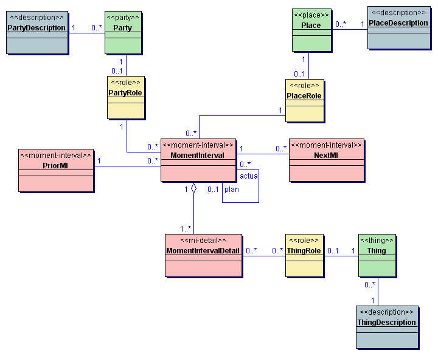
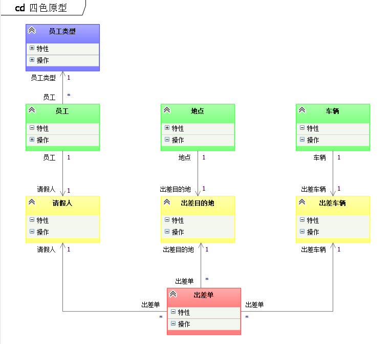
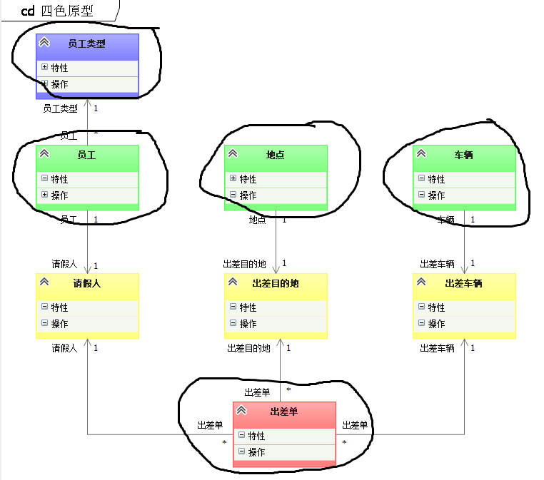

# 四色原型

## 简介

四色原型是一种 分析模式。四色原型是领域模型的一种原型。

四色原型可以用如下描述：

某个人（Party）的角色（PartyRole）在某个地点（Place）的角色（PlaceRole）用某个东西（Thing）的角色（ThingRole）做了某件事情（MomentInterval）。

图片示意：

## 分析

### 1、Moment-interval

**四色原型图中最重要的一个部分**。

原文对它的定义是：某一个时刻，或者某一段时间内发生的业务。定义非常的抽象，导致我们在使用四色原型图去分析业务的时候，很难确定到底什么是 MI。

**MI其实就是业务领域的关键性动词！**

例如，销售，报告，结算，确认订单 等等，这样关键性的动词，其实都表示一个 MI。

所以，我们也就知道如何发现一个 MI了，**在一堆堆的需求文字中，我们找到关键性的动词，它就是 MI**，也就是当前这个业务的核心了。围绕着这个 MI，我们会继续发现 ppt,role,desc 等等。

值得一提的是，虽然第一次找到了几个 MI，再经过分析后，很可能这些 MI 会合并到一起——这根据你的需求来设计。

**MI 可能是 DDD 的 SERVICE，更可能是 DDD 中的领域模型**。

### 2、PPT(Party, Place, Thing-人（组织）、地、物) 和 role

 **ppt 一般相当于领域模型**，而**寻找ppt也就是归纳名词的过程**。不过，之前我们一定会先找到 MI，所以这个 ppt 也是围绕着 MI归纳出来的。

Role 在四色原型里，Role可能是有生命也可能是没有生命的物体。例如，车是一个 ppt，坏掉的车则是车的一个role，良好的车也是车的一个role。

其实这里的 **Role 更多的是表达 PPT 的状态**，只不过四色原型中称之为 Role。

### 3、DESC

**desc 类似目录的结构，起到描述性的作用**。**它相当于领域模型的值对象**----我的理解也就达到这个程度，我觉得用值对象来类比它非常合适，容易让人理解。

### 4、四色原型，DDD 到底应该选择哪个？

四色原型其实正如其名字一样，**是一种分析模式**，**而不是设计模式**。

**分析阶段采用四色原型，而在设计阶段应该采用 DDD** 。

其实四色原型也没有什么特别深奥的地方，**面对需求文档，我们先找关键性动词，围绕它去找关键性名词，理清业务的逻辑**。这是我们常用的思维方式，不过四色原型将这个过程更加科学化，并且用图的方式让这个过程更加清晰。

所以，需求分析，不用四色原型也ok，但是使用四色原型，会更加顺利和清晰。

## 示例

### 出差管理示例

### 根据四色原型进行 DDD 聚合设计（四步曲）

#### 第一步：识别模型

根据四色原型很容易识别出领域模型（见上图）。

#### 第二步：识别关联

根据四色原型同样很容易识别出领域模型之间的关系（见上图）。

#### 第三步：划分聚合

- MI和MIDetail是一个聚合，MI是聚合根。
- PPT是一个聚合，PPT是一个聚合根。如果Des只“描述”PPT，那么这个Des会作为一个值对象隶属于属于PPT所在的聚合。
- Des是一个聚合，Des是一个聚合根。前提你想“跟踪”Des关联的PPT。
- Role不属于聚合，Role是一个带状态的领域服务，Role采用装饰器模式装饰PPT。

划分结果

#### 第四步：精简关联

- **去掉MI和Role之间的关联，改为仓储 Repository 查询，根据需要让MI关联一个Role的快照（发生时刻Role的状态）**。将关联改为仓储查询的理由是这样更加灵活，一个请假人有 1W 个请假单，没有必要设置这样的关联。**MI关联一个Role的快照的理由是MI很多情况要记录下发生时刻Role的状态**，如：出差单要记录下发生时刻请假人的组织信息，而不是现在的组织信息。
- PPT 和 DES 之间的关联可以根据自己的爱好酌情保留，用仓储查询更灵活。
- 去掉 PPT 和 Role 之间的关联，改为仓储 Repository 查询。比如：**用仓储 Repository 查出 PPT，然后将这个 PPT 实例注入到 Role 中**。

精简结果

