# 四色原型

## 简介

四色原型是一种 分析模式。四色原型是领域模型的一种原型。

四色原型可以用如下描述：

某个人（Party）的角色（PartyRole）在某个地点（Place）的角色（PlaceRole）用某个东西（Thing）的角色（ThingRole）做了某件事情（MomentInterval）。

图片示意：

### 分析方法

1、考虑在**某个时间点或时间段发生了什么事情**，那么这就是我们需要的MI

2、有了MI后，我们还要考虑**MI由谁完成，哪个角色才能完成**，那么这个就是我们需要的ROLE

3、**对具体发生对象PPT描述信息**，如部门信息、商品分类等等，这个是DESC

4、**具体发生对象**，如订单、商品，这个是PPT。

### 名词解释

#### 四色原型

1. **时间片段原型（the moment-interval archetype）**—粉红色。
2. **角色原型（the role archetype）**—黄色。
3. **人（组织）、地、物原型（the “party, place or thing” archetype）**—绿色。
4. **描述原型（the description archetype）**—蓝色

### 理解

#### 時間片段原型

**时间片段原型是四个原型中，最重要的一个，它在表达一段重要的时间片段。在某一个时间片段，我们可能做了某件需要被记录，以便日后可以进行追踪的工作或事情**。

当然，我们不会以时间片段为名，通常会已发生了什么样的事情，或者执行了什么样的工作，当做类别的名称。

例如，我前两天在网拍网站买了一台榨汁机，卖家指定超商取件，所以在汇款之后我得透过物流配送系统告知取件的资讯，卖家就会将货品配送到我指定的超商门市。从身为买家的我上线登录取件资讯，一直到我到超商真正取回货品，这是一段重要的时间片段，如图1所示。

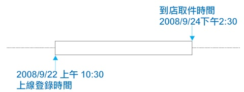

此时，我们可以套用时间片段原型的概念，用来记录这段重要的取件时间片段，如图2所示。

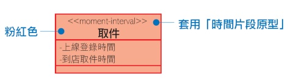

再看一个租借的范例，像是租借影片、书籍、车辆等等中的租借时段，其实都是时间片段原型的应用，如图3所示。

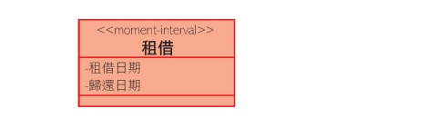

时间片段原型不仅能应用于一段时间，也可以应用于一个瞬间。比方说，我去便利超商买东西时，便利超商的 POS 系统（point of sale system）只需要记录销售发生的时间，像一个时间印记，或者说是一个时间瞬间，如图4所示。

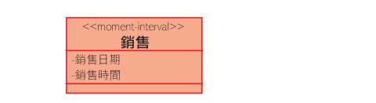

由于，时间片段原型会将其他原型连系在一起，它是核心又像是灵魂，所以在颜色的考量上，给予它像心脏般醒目的粉红色。再者，也考量到黑白印刷或手绘等等，不易显现颜色的情况，所以同时采用《moment-interval》字眼，用以标示出时间片段原型。

额外说明的是，时间片段可能有会有需要独立出来的细节，这时可以有另一个标记《mi-detail》的粉红色类别，代表时间片段的细节，如图5所示。

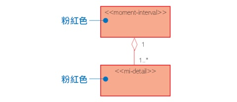

例如，一般的卖场销售就经常有一大串的细节，这时可以同时使用时间片段与时间片段细节的概念，如图6所示。

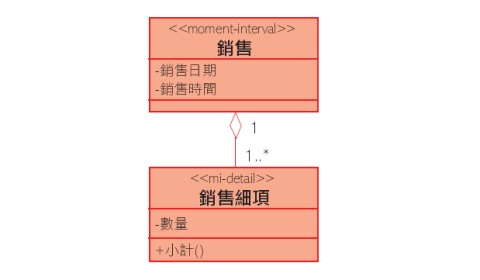

#### 角色原型

第二重要的原型是“角色”原型（role archetype），它的代表色是显眼的黄色，字标为《role》，如图7所示。

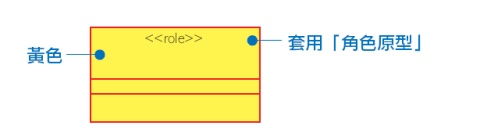

**一个人在不同的时刻中，可能扮演著不同的角色**，在公司扮演员工，回到家里扮演父母。人是用不同的角色来参与不同时间片段中的事件、情境。例如，在网拍平台上，针对不同的交易，个人有时扮演买方，有时扮演卖方，这就是角色原型的应用了，如图8所示。

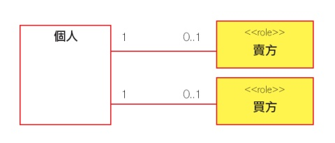

或者，有许多商家也开始在网拍市场中提供商品、扮演卖方，所以卖方的角色也可能由个人或公司组织来扮演，如图9所示。

既然，四色原型彼此相关联，我们也可以试著将角色原型和时间片段原型兜在一起，一块套用，形成如图10的模样。

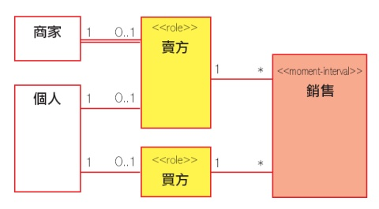

不过，角色原型谈的更广泛，包括人、组织、地、物都可能在扮演不同的角色。人或组织扮演不同的角色，这个观念比较容易理解，至于地、物扮演角色的观念比较不直觉，书中也没有多做解释，不太理解，想了很久也想不到什么样适当的范例，所以翻了翻书中的范例，节录了局部，关于物与角色的例子。

先看到图11的例子，**产品（Product）是物品（thing），已售产品（ProductBeingSold）是它的角色**。物料（MatlResource）是物品，已订物料（MatlBeingOrdered）和已用物料（MatlBeingUsed）都是它的角色。

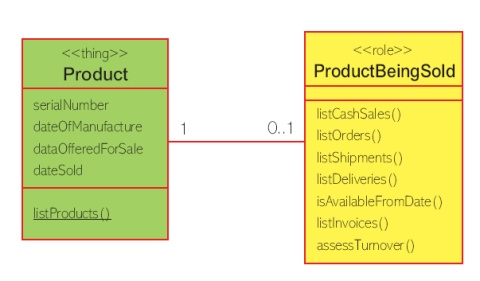

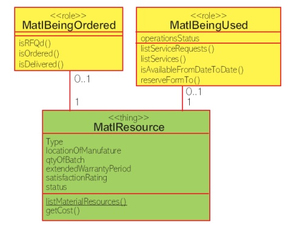

分析Peter Coad书中的范例，我觉得**物品的角色更像是物品的“状态”（state）**，也就是说，Peter Coad把物品的状态当作是物品的角色。我想应该还会有不同的解释，这是我目前的想法，写出来供您参考！

于是，我自己试著举一个图书馆借书的范例，每一本书都有三个重要的状态—预约书、借出书、馆藏书，所以我依照这三个状态设计出书籍的三个角色，如图13所示。

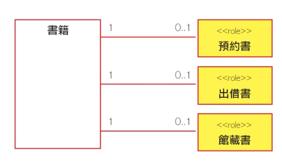

至于，地方（place）的角色，我也比照状态的概念，举了个停车位的范例，每一个停车位有两个重要的状态—已停车位或空车位，所以我同样依照这两个状态设计出停车位的两个角色，如图14所示。

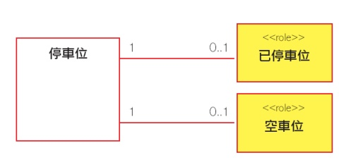

