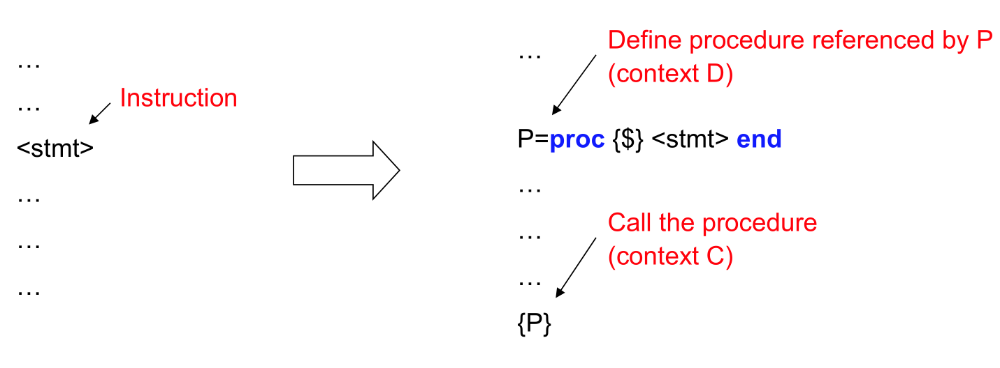

## Designing a language and its programs

### Languages that support two paradigms

许多语言都支持两种范式，通常一种用于小规模的编程，另一种用于大规模的编程。第一种范式是针对该语言最常见的问题而选择的。第二种范式是为了支持抽象性和模块化而选择的，在编写大型程序时使用。下面是几个例子。
- **Prolog** 第一个范式是基于统一和深度优先搜索的**逻辑编程引擎**。第二种范式是**命令式：断言和收回操作**，允许程序增加和删除程序子句。Prolog可以追溯到1972年，这使得它成为一种古老的语言。最近基于高级搜索算法的建模语言的发展推动了逻辑编程和命令式编程两方面的发展。现代的 Prolog 实现已经增加了其中的一些进步，例如，支持约束编程和模块系统。
- **建模语言**（如Comet、Numerica[48]）。第一种范式是求解器：约束编程、局部搜索、可满足性(SAT求解器)等。第二种范式是面向对象编程。
- **求解库**（如Gecode）。第一种范式是**基于高级搜索算法的求解库**，如Gecode。第二种范式是由宿主语言添加的，例如，C++和Java支持面向对象的编程。
- **语言嵌入**（如SQL）。SQL已经支持两种范式：**关系型编程引擎**用于数据库的逻辑查询，**事务型接口**用于数据库的并发更新。宿主语言通过支持面向对象的编程，对大型程序的组织进行补充。这个例子超越了两种范式，展示了一种具有三种互补范式的设计。


### A definitive programming language

从设计的共同结构中，我们可以推断出语言设计的几个合理后果。

1. 首先，声明式编程的概念是编程语言的核心。

2. 第二，在可预见的未来，声明式编程将保持核心地位，因为分布式、安全和容错编程是需要编程语言支持的基本课题。

3. 第三，确定性并发是并发编程的重要形式，不应该被忽视。确定性并发是利用多核处理器的并行性的一个很好的方法，因为它和函数式编程一样简单，而且它不能有竞争条件。

最后的结论是，消息传递并发（message-passing concurrency）是通用并发编程的正确默认值，而不是共享状态并发（shared-state concurrency）。


## Programming concepts

编程范式是由编程概念建立起来的。下面将介绍四个最重要的编程概念：即**记录（record）**、**词法范围的闭包（ lexically scoped closures）**、**独立性 independence（并发性 concurrency）**和**命名状态（named state）**。下面将解释这些概念以及为什么它们对编程很重要。


### Record

**记录是一种数据结构：一组对数据项的引用**，并对其中每个项目进行索引访问。例如：

```oz
R=chanson(nom:"Le Roi des Aulnes"
		artiste:"Dietrich Fischer-Dieskau"
		compositeur:"Franz Schubert"
		langue:allemand)
```

该记录 (Record) 由标识符 R 引用。成员可以通过点运算来引用，例如，R.nom 返回对字符串 "Le Roi des Aulnes "的引用。

记录是符号编程的基础。符号编程语言能够用记录进行计算：创建新的记录、分解记录、检查记录。许多重要的数据结构，如数组、列表、字符串、树和哈希表都可以从记录中派生出来。当与闭包 (clousre) 相结合时，记录可以用于基于组件的编程。


### Lexically scoped closure

**词法范围的闭包(lexically scoped closure)**，又简称**闭包（clousre）**，是一个非常强大的概念，是编程的核心。**函数式编程，也就是用闭包进行编程，是一个核心范式**。

从实现的角度来看，闭包将一个**过程和它所使用的外部引用组合在一起**。即使已经离开了创造该引用的环境，该引用仍然将会和该过程一起存在，不会单独失效。

从程序员的角度来看，闭包是一个 "工作包"：一个程序可以在程序的某一点将任何指令转化为闭包，传递到另一点执行。其执行的结果与在创建闭包时执行的结果是一样的（因为上下文环境一致）。


图9示意性地显示了定义闭包和调用闭包时发生的事情。

过程P由一个闭包来实现。在定义处，P 存储了P中所使用的上下文引用。例如，它保存了对某个命名状态的引用 x。

P 以及 P 的环境（引用集）的组合在其定义上下文中是封闭的（完整的）。在调用（上下文C）时，P 将使用闭包内部包含的引用（Context D中）。




图10显示了闭包的一种可能用途：创建一个控制结构。

在左边，我们执行指令<stmt>。在右边，我们没有执行<stmt>，而是把它放在一个由 P 引用的过程（闭包）中。在程序的任何时候，我们都可以调用 P，而效果一致

有了闭包，我们可以定义控制结构，如 if 语句或 while 循环。

几乎所有的编程语言都使用这种闭包。
- **函数是闭包;**
- **过程是闭包**
- **对象是闭包。**
- **类是闭包。**
- **软件组件是闭包**。

许多通常与特定范式相关的能力都是基于闭包的。
- **实例化和通用性**。通常与面向对象编程相关联，可以通过编写返回其他函数的函数来轻松实现。在面向对象编程中，第一函数被称为 "类"，第二函数被称为 "对象"。
- **分离关注点**。通常与**面向切面（aspect-oriented）**编程相关联，可以通过编写将其他函数作为参数的函数来轻松实现。例如，Erlang有一个实现通用容错客户端/服务器的函数。调用它时，它的函数参数定义了服务器的行为。在Pierre Cointe的章节中解释了面向对象语言中的面向切面编程。它通常是通过语法转换（称为 **"编织" Weaving**）来完成的，它将切面代码添加到源代码中（Java中通过反射修改源码）。AspectJ语言是这种方法的一个很好的例子。Weaving很难使用，因为它很脆弱：**很容易在程序中引入错误**（改变源代码会改变程序的语义）。使用闭包反而更容易保持正确性，因为源代码不会被改变。
- **基于组件的程序设计**是一种程序设计风格。在这种风格中，程序被组织成组件，其中每个组件可能依赖于其他组件。一个组件是一个构件，它指定了一个程序的一部分。一个组件的实例称为模块，它是一个包含闭包的记录。一个新的模块是由一个函数创建的，该函数将其依赖的模块作为输入。组件就是函数。

Erlang语言直接用闭包实现了所有这些能力。这是很实用的，也是可扩展的：已经开发出了超过100万行Erlang代码的成功商业产品（例如AXD-301 ATM交换机）。不过在大多数其他语言中，**闭包是隐藏在语言的实现**里面的，程序员不能直接使用。这可能是一个优势，因为实现可以保证闭包的正确使用。


### Independence (concurrency)

另一个关键概念是**独立性**：将程序构造为独立的部分。这并不像看起来那么简单。例如，考虑一个由一个接一个执行的指令组成的程序。这些指令并不独立，因为它们是按时间顺序排列的。为了实现独立性，我们需要一个新的编程概念，叫做**并发性**。当两个部分完全不交互时，我们说它们是并发的。 ( 当两个部分的执行顺序给定时，我们说它们是顺序的 )。并发部分可以扩展出一些定义明确的交互，这就是所谓的通信。

并发不应该与并行相混淆。并发是一个语言概念，并行是一个硬件概念。如果两个部分在多个处理器上同时执行，它们就是并行的。并发和并行是正交的：可以在单个处理器上运行并发程序（使用抢先调度和时间片），也可以在多个处理器上运行顺序程序（通过并行计算）。在多核处理器上的并行执行将在第38页解释。

现实世界是并发的：它由独立发展的活动组成。计算世界也是并发的。它有三个层次的并发性。
- 分布式系统：通过网络连接的一组计算机。一个并发活动称为一台计算机。这是互联网的基本结构。
- 操作系统：管理计算机的软件。一个并发活动称为一个进程。进程有独立的存储器。操作系统处理将进程执行和内存映射到计算机的任务。例如，每个正在运行的应用程序通常在一个进程中执行。
- 一个进程内的活动。一个并发活动称为一个线程。线程独立执行，但共享同一个内存空间。例如，不同的 Web浏览器中的窗口通常以独立的线程执行。

进程和线程的根本区别在于如何进行资源分配。进程级并发有时也被称为竞争并发：每个进程都试图为自己获取系统的所有资源。操作系统的主要作用是仲裁所有进程完成的资源请求，并以公平的方式分配资源。线程级并发有时也被称为合作并发：进程中的线程共享资源，协作实现进程的结果。线程运行在同一个应用程序中，因此要受同一个程序的指导。

并发有两种流行的范式。第一种范式是共享状态并发：线程使用称为监视器的特殊控制结构访问共享数据项，以管理并发访问。这种范式是目前最流行的。几乎所有主流语言都使用它，如Java和C#。另一种共享状态并发的方式是通过事务：线程原子化地更新共享数据项。这种方式被数据库和软件事务性存储所使用。

第二种范式是消息传递并发：并发代理各自在一个线程中运行，互相发送消息。语言CSP（Communicating Sequential Processes）和Erlang使用消息传递。CSP 进程发送同步消息（发送进程等待，直到接收进程接收到消息），而Erlang进程发送异步消息（发送进程不等待）。

尽管监控器很受欢迎，但监控器是编程中最难用的并发基元。事务和消息传递比较容易，但仍然很难。这三种方法都受到其表达性的影响：它们可以表达非确定性的程序（其执行不完全由其规范决定），这就是为什么很难推理它们的正确性。如果以某种方式控制非确定性，使其对程序员不可见，那么并发编程就会简单得多。第6节和第7节介绍了四个重要的范式，它们实现了这一思想，使并发编程变得更加简单。


### Named state

最后我们要介绍的关键概念名为状态。状态在程序中引入了一个抽象的时间概念。在函数式程序中，不存在时间的概念。函数是数学函数：当用相同的参数调用时，它们总是给出相同的结果。函数是不会改变的。在现实世界中，情况有所不同。现实世界中很少有实体具有函数的永恒行为。生物体在成长和学习。当同样的刺激在不同的时间给生物体，反应通常会不同。我们如何在程序里面进行建模呢？我们需要模拟一个具有独特身份（它的名字）的实体，它的行为在程序执行过程中会发生变化。要做到这一点，我们在程序中添加一个抽象的时间概念。这个抽象的时间是一个简单的时间值序列，它有一个单一的名字。我们称这个序列为命名状态。未命名状态也是可能的（单项式和DCG，见2.1节），但它不具备命名状态的模块化特性。


图11显示了两个组件A和B，其中组件A有一个内部命名的状态（内部存储），组件B没有。组件B总是具有相同的行为：每当用相同的参数调用它时，它都会给出相同的结果。如果组件A的命名状态中包含了不同的值，那么每次调用它都可以有不同的行为。拥有命名状态既是一种祝福也是一种诅咒。它是一种祝福，因为它允许组件适应环境。它可以成长和学习。它是一种诅咒，因为如果命名状态的内容是未知的或不正确的，那么拥有命名状态的组件就会产生不稳定的行为。一个没有命名状态的组件，一旦被证明是正确的，就会一直保持正确。对于一个有命名状态的组件来说，正确性的保持并不那么简单。一个好的规则是，命名状态永远应该是可见的：总是有一些方法可以从外部访问它。


#### Named state and modularity

**命名状态对于一个系统的模块化很重要**。如果一个系统（函数、过程、组件等）可以在不改变系统其他部分的情况下对系统的一部分进行更新，那么这个系统就是模块化的。我们给出一个场景来说明我们如何通过使用命名状态来设计一个模块化系统。如果没有命名状态，这是不可能的。

假设我们有三个开发者，P、U1、U2。P开发了一个模块M，其中包含两个函数F和G 。U1和U2是M的用户：他们自己的程序使用了M模块。以下是M的一个可能的定义 

```Oz
fun {ModuleMaker}
    fun {F ...}
    ... % Definition of F
    end
    fun {G ...}
    ... % Definition of G
    end
in
	themodule(f:F g:G)
end
M={ModuleMaker} % Creation of M
```

函数 ModuleMaker 是一个组件，它定义了系统的一部分行为。我们通过调用 ModuleMaker 来创建这个组件的实例。一个这样的实例就是模块M 。请注意，一个模块的接口只是一个记录，其中每个字段是模块的一个操作。模块M有两个操作F和G 。

现在假设开发者 U2 有一个消耗了大量计算时间的应用程序。U2想调查这些时间都花在了哪里，这样他就可以重写他的应用程序以减少成本。U2怀疑F被调用的次数太多，他想验证一下。U2希望有一个新版本的M能计算F被调用的次数。所以U2联系了P，让他创建一个新版本的M，来实现这个功能，但不改变接口，因为如果不这样做，U2将不得不改变他所有的程序。

如果没有命名状态，这是不可能的。如果F没有命名状态，那么它就不能改变自己的行为。特别是，它不能记录它被调用的次数。


##### Unnamed state

在一个没有命名状态的程序中，唯一的解决办法是改变F的接口（它的参数），如下：

```Oz
fun {F ... Fin Fout}
    Fout=Fin+1
    ...
end
```

F增加了两个参数，即Fin和Fout。当调用F时，Fin给出了F被调用的次数，而F通过在Fin中加1来计算Fout中的新次数。对F的连续三次调用是这样的。

```Oz
A={F ... F1 F2}
B={F ... F2 F3}
C={F ... F3 F4}
```

F1 是初始计数。第一次调用计算出 F2 ，它被传递给第二次调用，以此类推。最后调用返回计数F4 。

这是一个非常糟糕的解决方案，因为改变了调用的接口，导致 U2 必须改变他程序中对于 F 的调用。更糟的是：U1也必须改变他的程序，尽管U1从未要求任何改变。所有M的用户，甚至是U1，都必须改变他们的程序。


##### named state

解决这个问题的方法是使用命名状态。我们给模块M一个**内部存储**，用于记录状态 。在 Oz 中，这个内部存储器被称为单元或可变单元。这简单的对应于很多语言所说的**变量**。下面是解决方案。

```oz
fun {ModuleMaker}
    X={NewCell 0} % Create cell referenced by X
    fun {F ...}
        X:=@X+1 % New content of X is old plus 1
        ... % Original definition of F
    end
    fun {F ...}
    	... % Original definition of G
    end
    fun {Count} @X end % Return content of X
in
	themodule(f:F g:G c:Count)
end
M={ModuleMaker}
```

新模块M里面包含一个单元（cell）。每当调用F时，单元就会递增。附加的操作 Count (由 M.c 访问) 返回单元格的当前计数。F 和 G 的**接口没有变动**。由于F和G的调用方式是一样的，所以没有人需要改变他们的程序。这说明命名状态是如何解决模块化问题的。

命名状态的主要优点是程序变得**模块化**。主要的缺点是程序可能变得不正确。看来，我们需要同时拥有和不拥有命名状态。我们如何解决这个两难的问题呢？

一种解决方案是将**命名状态的使用集中在程序的一部分**，而在其余部分避免使用命名状态。图12显示了这种设计的工作原理。程序的大部分是一个没有命名状态的纯函数。程序的其余部分是一个状态变换器：它调用纯函数来完成实际工作。这就将命名状态集中在程序的一小部分。


## 其他补充

### 闭包 Clousre

在计算机科学中，**闭包（Closure）**，又称**词法闭包（Lexical Closure）**或**函数闭包（function closures）**，是在支持**头等函数**的编程语言中实现**词法绑定**的一种技术。

闭包在实现上是一个结构体，它存储了**一个函数（通常是其入口地址）**和**一个关联的环境**（相当于一个符号查找表。闭包创建时上下文环境的一部分）。环境里是若干对符号和值的对应关系，它既要包括**约束变量**（bound variable, 该函数内部绑定的符号），也要包括**自由变量**（free variable，**相对于函数而言，不受函数的限制**。在函数外部定义但在函数内被引用），有些函数也可能没有自由变量。

闭包跟函数最大的不同在于，当**创建闭包**的时候，它的**自由变量会在闭包创建时被捕捉**，这样即便脱离了创建时的上下文，它也能照常运行。捕捉时对于值的处理可以是**值拷贝**，也可以是**引用**，这通常由语言设计者决定，也可能由用户自行指定。

闭包和匿名函数经常被用作同义词。但严格来说，匿名函数就是**没有被赋予名称的函数**，而闭包实际上是一个**函数的实例**，它是**存在于内存**里的某个**结构体**。

如果从实现上来看的话，匿名函数如果没有捕捉自由变量，那么它其实可以被实现为一个**函数指针**，或者直接内联到调用点，如果它捕捉了自由变量那么它将是一个闭包；而闭包则意味着同时包括函数指针和环境两个关键元素。在编译优化当中，没有捕捉自由变量的闭包可以被优化成普通函数，这样就无需分配闭包结构体，这种编译技巧被称为**函数跃升**。

#### 历史

闭包的概念是在20世纪60年代发展起来的，用于对λ演算（ [λ-calculus](https://en.wikipedia.org/wiki/Λ-calculus)）中的表达式进行求解，1970年首次作为PAL编程语言中的一个语言功能被完全实现，以支持词法范围的一级函数。

Peter J. Landin在1964年定义了闭包一词，认为它有一个环境部分和一个控制部分，用于在他的SECD机器上对表达式求值。

Joel Moses认为Landin引入了闭包一词，指的是一个**lambda表达式**，它的**开放绑定(自由变量)已经被词法环境封闭(或内部绑定)**，从而形成了一个**封闭的表达式（closed expression）**，或**闭包（clousre）**。这种用法随后被Sussman和Steele在1975年定义 Scheme 时采用，这是LISP的一个词法范围变体，并得到了广泛的应用.


#### 自由变量

一个函数中出现的变量中，函数的**参数**及函数中定义的**局部变量**称为**“约束变量”（bound variable，称之为限界变量更合适）**，而其它的则是**自由变量（free variable）**。如下代码：

```c
int tripple = 20;
int global = 10;
int function(int x) {
    int tripple = 0;       // variable tripple is bound because it is local
    tripple = global * 3;  // global is free
    return x + tripple;    // x is bound
}
```

这个函数 `function` 中：

1. `x` 是参数，`tripple` 是局部变量，它们的值和生命周期**存在于函数 `function` 的环境中，不能离开`function`而存在**，因此称为限界变量；
2. `global` 的**值和生命周期存在于 `function` 之外，不受函数 `function` 控制**， 所以相对于 `function`和其中的其他变量而言是自由的，称之为自由变量。

只是自由变量（及其词法环境）是和 `function` 是绑定的，自由变量即使脱离了其词法环境或者定义环境，仍然是存在的。


#### 自由变量和全局变量

自由变量不一定是全局变量。

C 不允许我们在函数中定义函数，没有了函数嵌套，函数内的自由变量当然只能指向全局或者文件作用域了。

但在其它**支持嵌套定义函数**的语言中就不是这样了，如下面的 Python 代码：

```python
shadowed_var = 10                  # global variable 
def outer(x):
    shadowed_var = 20              #  <--+ free variable for inner function
    def inner(y):                  #     | bound variable for inner
        tripple = 0                #     |
        tripple = shadowed_var * 3 #-----+
        return x + y + tripple
    return inner

inner = outer(10)
inner(20)
```

函数 `inner` 中的变量 `shadowed_var` 就是一个自由变量，但在运行时，它指向的是 `outer` 函数中的 `shadowed_var`， 而不是全局的。


#### 环境 environment

上例代码中 **“环境 (environment)”** 情况如下：

```python
+==================================
| Global envirnment
+==================================
| shadowed_var: 10
|
| > inner = outer(10)
| +============================
| | Outer function environment
| +============================
| | x: 10
| | shadowed_var: 20             <-----\
| |                                    |
| | +===========================       | 
| | | Inner function environment       | 
| | +===========================       |
| | | y: argument                      |
| | | tripple = shadowed_var * 3  -----/ shadowed_var refers to the outer function environment
| | | return x + y + tripple
|
| inner(20)
```

当一个函数运行时，系统（也可能是语言的解释器）就会为它创建一个**运行时环境（runtime environment）**，会将函数的限界变量放入函数的运行时环境中。例如上图中全局环境与 `outer` 函数的环境各有一个 `shadowed_var` 变量。

而闭包要求：如果一个**闭包（函数）创建**时，其中的自由变量指向某个环境（中的相应变量），那么即使该闭包（函数）已经离开了这个环境，那么该闭包（函数）中的自由变量依旧要指向创建时指向的环境（中的相应变量）。

如上例中`inner` 函数在创建时，其中的 `shadowed-var` 指向 `outer` 环境中的 `shadowed-var`，即调用 `inner(20)` 时已经离开了 `outer` 环境，函数 `inner` 中的 `shadowed_var` 依旧指向 `outer` 环境中的 `shadowed_var` 变量，而不是全局环境中变量。

**自由变量与环境的结合是闭包技术的关键**，有时也把函数本身和指向的环境共同称为闭包。


#### 静态和动态作用域

作用域是指一个变量的名与值的绑定的有效范围。例如上节中的例子中，`shadowed_var` 是个名字，它的值可以是 `10`（全局环境中），也可以是 `20`（在 `outer` 环境中），这个对应关系的生效范围就是作用域。

**静态作用域**也称作“**词法作用域 (lexical scope)**“。闭包也被称为“**词法闭包（Lexical Closure）**”，其实在上节介绍自由变量时介绍的**变量绑定方法（闭包中自由变量与环境的绑定）就是静态作用域**。

在静态作用域下，变量绑定是**由源代码的位置结构（词法结构）决定的**，即在**查找变量**时，依据的是**函数定义 / 生成时所在的环境**。

如上节的 Python 代码中，函数 `inner` 在生成时处在`outer` 环境，因此函数 `inner` 在运行时，仍旧需要在 `outer` 环境中去查找变量 `x` 和变量 `shadowed_var` 的值。

相比之下，**动态作用域**则**不论源代码的结构**，所有的自由变量的值**均在运行时的环境中查找**。

静态和动态作用域运行时环境对比如下图：

```python
      Lexical Scope                                    Dynamical Scope
+==================================            +==================================
| Global envirnment                            | Global envirnment
+==================================            +==================================
| shadowed_var: 10                             | shadowed_var: 10           <-----\
|                                              |                                  |
| > inner = outer(10)                          | > inner = outer(10)              |
| +============================                | +============================    |
| | Outer environment                          | | Outer environment              |
| +============================                | +============================    |
| | x: 10                     <---------\      | | x: 10                          |
| | shadowed_var: 20             <---\  |      | | shadowed_var: 20               |     
|                                    |  |      |                                  |     
| > inner(20)                        |  |      | > inner(20)                      |     
| +===========================       |  |      | +===========================     |     
| | Inner                            |  |      | | Inner                          |     
| +===========================       |  |      | +===========================     |     
| | y: 20                            |  |      | | y: 20                          |     
| | tripple = shadowed_var * 3   ----/  |      | | tripple = shadowed_var * 3   --/     
| | return x + y + tripple      --------/      | | return x + y + tripple    # x is undefined
```

如上图，如果在动态作用域中，变量查找只会在运行上下文中查找，本例中只会在全局环境中查找。所以运行 `inner(20)` 时，`shadowed_var` 在全局环境中为 `10`，而变量 `x` 则由于未定义而出错，因为全局的环境中并未定义 `x` 变量。

此外，**动态作用域的代码无法模块化**，因为代码执行的结果总是**依赖于调用上下文**。

从上可知，Clousre 闭包中，函数与其指向的环境一起**构成了整体，是闭合的**，可以**脱离创建时的词法环境而存在，所以称之为闭包**。而动态作用域，就不能脱离调用时的上下文环境而存在，构不成闭包。所以闭包也称为“词法闭包”。


### 闭包的作用

#### 头等函数

典型的支持闭包的语言中，通常将函数当作第一类对象——在这些语言中，函数可以被当作参数传递、也可以作为函数返回值、绑定到变量名、就像字符串、整数等简单类型。如Python 和 Rust 等语言都支持闭包。


#### 状态表达

闭包可以用来在一个**函数与一组（对该函数而言）“私有”的变量**之间创建关联关系。在给定函数被多次调用的过程中，这些私有变量能够保持其持久性。

变量的作用域仅限于包含它们的函数，因此无**法从其它程序代码部分进行访问**。正因为这一特点，闭包可以用来完成**信息隐藏**，并进而应用于需要状态表达的某些编程范型中。


#### 定义控制结构

因为闭包**只有在被调用时才执行操作**（暂且不论用于生成这个闭包对象本身的开销，比如 C++ 中按值捕获意味着执行复制构造函数），即“惰性求值”，所以它可以被用来定义控制结构。

因为闭包在定义时，只是定义了处理算法，以及绑定了自由变量。等待外部调用传入参数之后才会执行算法并返回结果。

例如：在 Smalltalk 语言中，所有的控制结构，包括分支条件（if/then/else）和循环（while和for），都是通过闭包实现的。用户也可以使用闭包定义自己的控制结构。

smalltalk 中分支条件定义：

```smalltalk
condition
   ifTrue: [ do this ]
   ifFalse: [ do that ]
```

smalltalk 中循环定义：

```smalltalk
[ iterator hasNext ]
    whileTrue: [ iterator next ].
1 to: 10 do: [ :each | ... ].
```


#### 实现对象系统

闭包可以使得代码模块化、独立存在；从另一个方面看，闭包也将数据和对数据的处理 “封装” 在一起。

以上的两个性质是对象的关键性质，所以可以用闭包模拟对象系统。


### lambda 演算

#### Lambda演算

> **λ演算**（lambda calculus，λ-calculus）是一套从数学逻辑中发展，以变量绑定和替换的规则，来研究函数如何抽象化定义、函数如何被应用以及递归的形式系统。

因为这里Lambda演算不是讨论的重点，我举几个简单的例子，让大家明白就好。

在Lambda演算中，每个表达式都代表一个函数，这个函数有一个参数，并且会返回一个值。也就是说在Lambda演算中只有函数。

1. Lambda演算的基本定义：

   **λx. E**，x是参数，并且有且仅有一个参数，E是函数体。

2. 函数的应用：

   **E1 E2**，E1是个函数，E2也是个函数，并且每个函数都有返回值，E2的返回值当成**λx. E**的x，带人到E1的函数中，在返回E1的结果。

这样还是很难理解，再来个个例子。

现在我们定义一个数学函数f(x) = x + 2，数学意义很明显，就给x加上2。怎么用Lambda演算弄？

1. Lambda演算的基本定义：

   λx. x + 2，x是参数，x + 2函数体。

2. 函数的应用：

   当有个参数λa.a 3的时候就是这个样子(λx. x + 2) (λa.a 3)，可以写成也就符合上面的**E1 E2**格式。结果就是(λx. x + 2)3 = 3 + 2 = 5

这里有没有特别的熟悉，说说编程函数定义。

```javascript
returnValue funcitonName(parameter){
  methodBody
}
```

假如这个函数只能传入一个参数，那么是不是就是 **λx. E**的简单表达，原来函数的由来可以这样追溯。

#### Lambda演算的加法问题

Lambda演算只支持一个参数，我想计算f(x, y) = x + y怎么算呢，λx y. x + y，这样是违反规则的，不要着急我们可以采用Currying的方式，λx.λy.x + y，调用的时候是这样的（λx.λy.x + y) (7 2) = （λy.7 + y)(2) = (7 + 2) = 9。想一下程序怎样写。

```javascript
function add(x){
  return (function(y) {
    return x+y;
});
}
add(100)(12);
```

这个不是闭包吗，我们绕了一大圈终于把闭包的源头找到了，闭包是这样来的。

