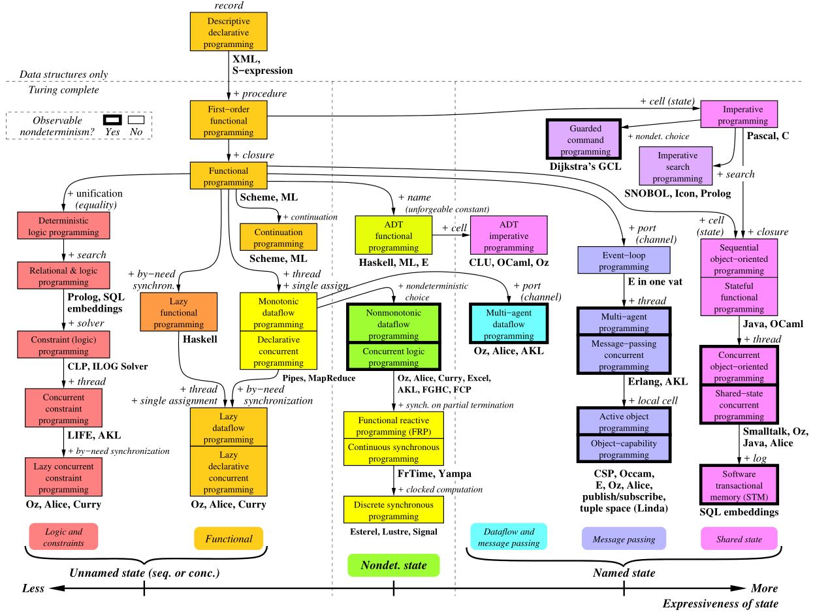
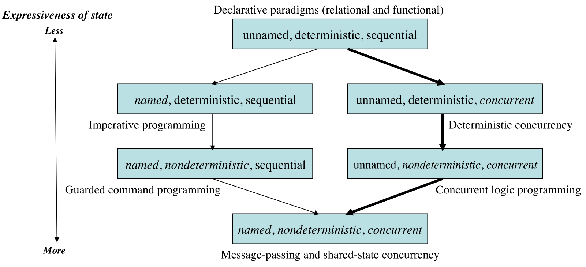
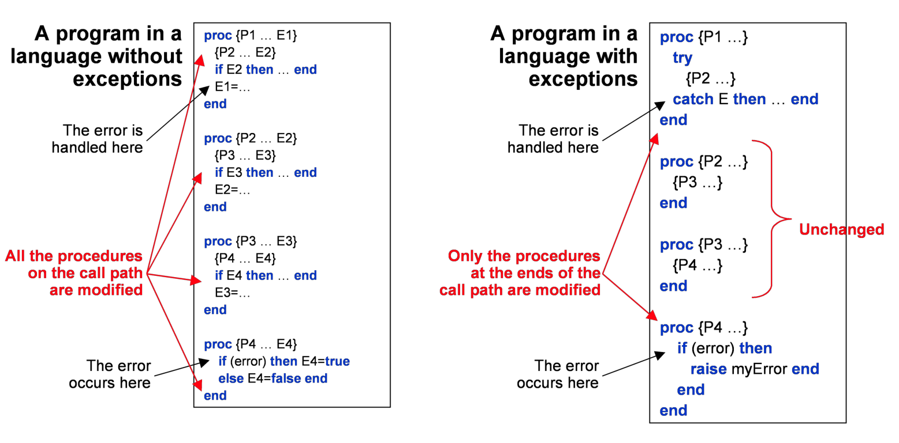

## Programming Paradigms

### 分类

#### 解释

有27个方框，每个方框代表一个范式，作为一组编程概念。在这 27 个方框中，有 8 个包含了两个名称不同但概念集相同的范式。两个方框之间的箭头代表从一个范式到下一个范式所必须添加的概念。这些概念是用来构建范式的基本基本元素。通常，两个看似截然不同的范式（例如，函数式编程和面向对象编程）仅有一个概念的不同。

有了n个概念，从理论上讲，它是。可以构建  $2^n$ 个范式。当然，这些范式中很多都是无用的 实践，如空范式（0概念）或只有1个概念的范式。

范式几乎必须是图灵完备（Turing complete）的才是实用的。这解释了为什么**函数式编程（functional programming）**如此重要：它是基于**头等函数（first-class function）**或**闭包（ closure）**的概念，这使得它相当于图灵完备的 **λ 演算（λ-calculus）**。

 在  $2^n$ 种可能的范式中，实际有用的范式数量要少得多。但仍比 n 大得多。

在上图中，在一个范式框下写了某一种语言，意味着语言中的至少有一部分是完全支持该范式的。但是这并不意味着语言和范式之间是完美契合的，仅仅用语言编写了支持范式的库是不够的。语言的内核语言（ kernel language）应该支持范式。当有一系列相关的语言是，通常只展示其中一个成员，以避免混乱。上图并不是判定语言好坏的标准，只是作为示例。

### 范式的重要属性

#### Observable nondeterminism

**不确定性（nondeterminism）是指一个程序运行不完全由它本身的表述（specification）决定。** 比如程序运行在多线程环境，则由系统的调度器（scheduler）决定下一步运行哪一个线程。

如果用户使用**同一种内部配置，可以观察到不同的运行结果**，就表明不确定性是可观察到的。Observable nondeterminism 一般是不可接受的。

一个典型的结果是**竞争条件（race condition）**，在这种情况下，程序的结果取决于程序不同部分在时间上的精确差异（也就是存在竞争）。当时间差异影响了调度器的选择结果，就会发生上述情况。

但是具有表现 observable nondeterminism 特性的范式 Paradigm 可以用来给真实情况建模以及处理一些独立的事件。

由上可知，只有当需要的时候才应该支持 Observable nondeterminism，特别是在并发编程中。例如，Java语言可以表达可观察的非确定性，因为它同时具有命名状态和并发性（见下文）。这使得Java中的并发编程相当困难。如果采用声明式并发范式，并发编程就容易多了，在这种范式中，所有的程序都是确定性的。

#### Named state

状态（state）是一种记忆信息的能力，或者更准确地说，存储一系列不同时间的值。

可从三个角度衡量范式对 state 的支持程度：命名（named）或未命名，确定（deterministic ）或者不确定，顺序（ sequential）或者并发（concurrent）

共有8中组合，如下图。并不是所有的组合都是有用的。

对 state 不同级别的支持如下：

一个有趣的语言是 Dijkstra 的防御式命令语言（Guarded command language，GCL）。它是有命名状态和非确定性的顺序语言。它使用非确定性来避免过度指定算法（描述太多关于它们应该如何执行的算法）。

上图中的范式根据它们对状态（state）的支持力度，在一条横轴上进行分类，对应于图中的粗线。让我们沿着这条线从上到下看。表现力最弱的组合是函数式编程（线程状态，例如 Prolog 中的 DCGs 和函数式编程中的 monads：未命名、确定性和顺序性）。增加并发性，就可以得到声明式并发编程（例如，同步式编程：未命名、确定性和并发）。添加非确定性选择，给出了并发逻辑编程（使用流合并：未命名、非确定性和并发）。添加端口（port）或单元（cell），得到消息传递（message passing）或共享状态（shared state）（都是命名、非确定性和并发）

非确定性（Nondeterminism）对于真实世界的交互(例如，客户端/服务器)是很重要的。命名状态（Named state）对于模块化很重要。

#### 小结

在选择一种能充分表达，但又不能过分表达的范式的时候，无论是可观察的非确定性（ observable nondeterminism）还是命名状态（named state）都是十分重要的。

这两个概念有时都是必要的，但如果不是必要的，就应该忽略。关键是要选择一个具有合适概念（concept）的范式。概念太少的话，程序就会变得复杂。概念太多，逻辑就会变得复杂。

### 创造性扩展原则

概念不是任意组合起来就能形成范式的。它们可以根据创造性扩展原则来组织。它给我们提供了一个指南，让我们在大量可能的范式中找到秩序。

在一个给定的范式中，可能会发生这样的情况：**由于技术原因，程序变得复杂，但是这些技术原因与正在解决的具体问题没有直接关系。这是一个信号，表明有一个新的概念等待被发现**。为了说明这个原理是如何工作的，假设我们有一个简单的顺序函数式编程范式。例如有三种情况，说明如何发现新的概念，并加入新的概念形成新的范式。

- 如果我们需要对几个独立的活动进行建模，那么我们就必须实现几个**执行堆栈、**一个**调度器**和一个从一个活动转到另一个活动的**优先级算法**。如果我们在语言中加入一个概念：**并发（concurrency）**，那么所有这些复杂性都是不必要的。

- 如果我们需要对可更新的存储（updatable memory）进行建模，也就是说，实体会**记住并更新它们的过去**，那么我们就必须在所有与该实体相关的函数调用中添加两个参数。代表该实体对应存储的输入（原始值）和输出（更新后的值）。这很笨拙，而且也不是模块化的，因为该实体的存储会在整个程序中游走。如果我们在语言中加入一个概念：**命名状态（named state）**，所有这些都是不必要的。
- 如果我们需要对错误检测和纠正进行建模。在这种情况下，任何函数都可以在任何时候检测到错误，并将控制权转移到纠错例程，那么我们就需要在所有函数输出中添加错误代码，并添加条件来测试函数调用返回的代码，判断是否出错来决定下一步如何处理。如果我们在语言中加入一个概念：**异常（exception）**，那么所有这些复杂都是不必要的。例如下图所示：

#### 解释

如上图中所示。在没有 exception 概念的时候，从 P1 到 P4 的调用链上，如果 P4 中可能出现问题在 P1 中处理问题。虽然P4 出现的异常和P2 和P3 没有关系，但是在 **P2，P3 中也需要主动判断处理异常**。如果异常处理有改动，那么P1到P4 **整个调用链条上的代码都需要改动**。

在加入异常 exception 概念之后，P4 出现异常，可在P4 中处理、抛出，**P2 和 P3 无需做处理**，只需要简单向上抛出异常即可，**最终由对此感兴趣的P1 主动捕捉处理**。如果此时异常处理有变动，只需要修改 P4和P1的处理程序即可。

#### 小结

在上述顺序函数式编程范式的例子中，三种情况（concurrency，named state，exception）（还有很多其他情况！）的**共同主题是**：如果在程序各处遇到了该问题，我们都需要**对程序进行类似普遍性（非局部）修改**，以解决该问题。如果对普遍性修改的需求表现出来，我们可以将其视为一个新概念等待被发现的信号。通过将这个概念添加到语言中，我们不再需要这些普遍性的修改，我们恢复了程序的简单性。**程序中唯一的复杂性是解决问题所需要的，而不需要额外的复杂性来克服语言的技术不足**。

## 其他补充概念

### Turing Complete

#### 含义

图灵完备（Turing Complete）是指在系统中一组数据操作的规则（一组指令集、编程语言或元胞自动机）满足任意数据按照一定的顺序可以计算出结果（无限运行时间和内存，通常是理想情况）。

#### 图灵完备语言

现在大多数语言如 Java，JavaScript，Perl，C，C++都是图灵完备语言，因为它们都实现了所有运行程序的特性，如算术运算、if-else控制流、返回语句等等。

有一些语言不是图灵完备语言，如XML，它仅仅是充当数据容器，本身不具有计算出结果的能力。

### First-Class Function

**类型，定义了一个取值的集合，以及可作用的操作的集合**。如C语言的int类型有一个上下界，可进行加减乘除等操作。变量可能有 int，float，string 等类型，函数、对象等也有类型。

进一步，可以把类型分为三类：

1. **First Class**。该类型的值可以作为**函数的参数和返回值，也可以赋给变量**。
2. **Second Class**。该类型的值**只可以作为函数的参数**，但**不能从函数返回，也不能赋给变量**。
3. **Third Class**。该类型的值**作为函数参数也不行**

**头等函数**（first-class function）是指在程序设计语言中，**函数被当作头等公民**。这意味着，**函数可以作为别的函数的参数、函数的返回值，赋值给变量或存储在数据结构中**。 

有人主张应包括支持匿名函数（函数字面量，function literals）。在这样的语言中，函数的名字没有特殊含义，它们被当作具有**函数类型的普通的变量**对待。1960年代中期，克里斯托弗·斯特雷奇在 “functions as first-class citizens” 中提出这一概念

结构化程序设计的**精髓在于模块复用和访存控制**。如果说函数实现了代码复用，那么在支持First Class Function的语言中，**高阶函数**作为函数之间的胶水，进一步方便了函数的复用。函数式语言中，基本都会有 map, reduce, filter, zip 这些经典的**高阶函数**。

#### 高阶函数

在数学和计算机科学中，**高阶函数是至少满足下列一个条件的函数**：

- **接受一个或多个函数作为输入**

- **输出一个函数**

在数学中它们也叫做**算子（运算符）或泛函**。微积分中的导数就是常见的例子，因为它映射一个函数到另一个函数。